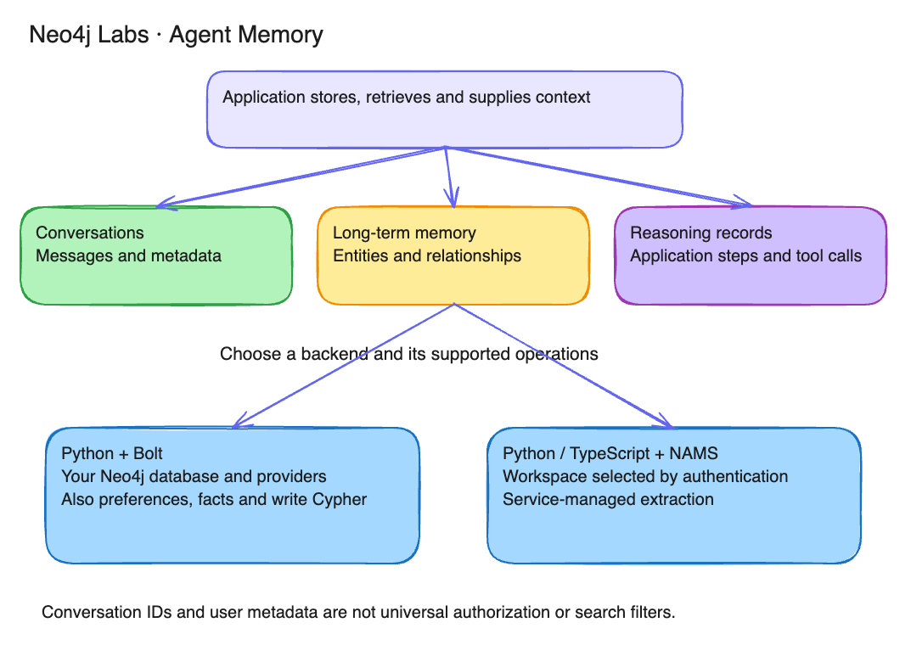
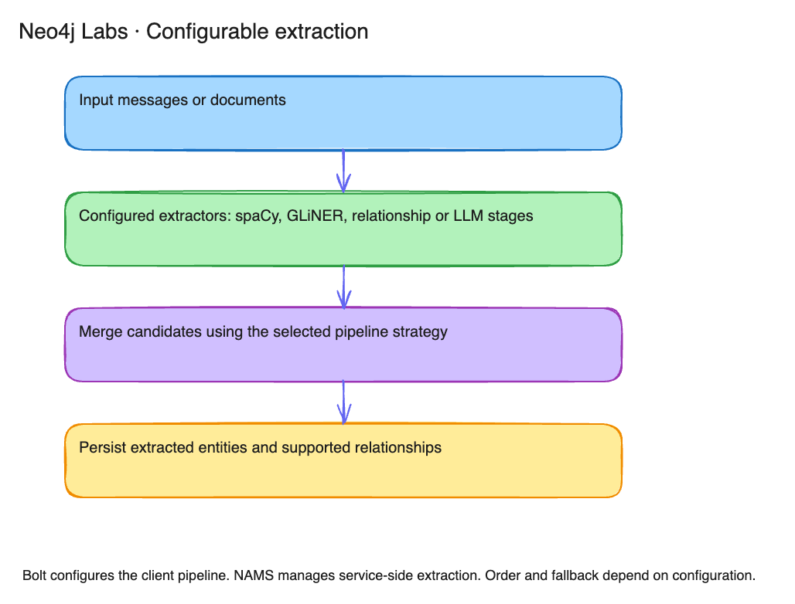
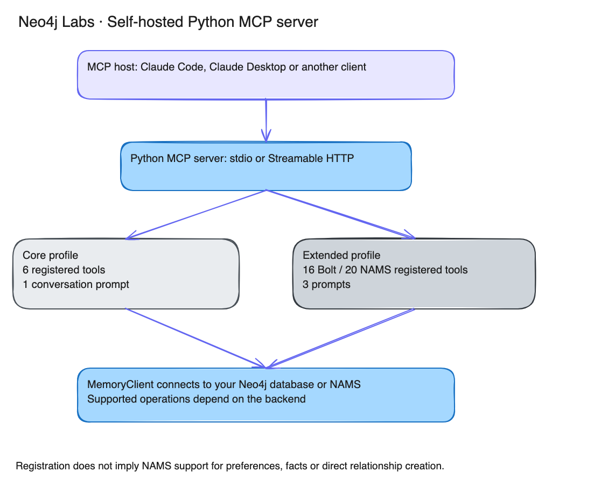

# Neo4j Agent Memory

A graph-native memory system for AI agents. Store conversations, build knowledge graphs, and record and retrieve application-supplied reasoning -- all backed by Neo4j.

[](https://neo4j.com/labs/)
[](https://neo4j.com/labs/)
[](https://community.neo4j.com)
[](https://github.com/neo4j-labs/agent-memory/actions/workflows/ci-python.yml)
[](https://github.com/neo4j-labs/agent-memory/actions/workflows/ci-typescript.yml)
[](https://badge.fury.io/py/neo4j-agent-memory)
[](https://www.npmjs.com/package/@neo4j-labs/agent-memory)
[](https://pypi.org/project/neo4j-agent-memory/)
[](https://opensource.org/licenses/Apache-2.0)

> **Neo4j Labs project**
>
> This project is part of Neo4j Labs and is actively maintained, but not officially supported. There are no SLAs or guarantees around backwards compatibility and deprecation. For questions and support, please use the [Neo4j Community Forum](https://community.neo4j.com).
>
> The Python and TypeScript packages in this repository are versioned and released independently; the status badge above reflects this package's own maturity, not the other SDK's.

## What it does



| Short-Term Memory | Long-Term Memory | Reasoning Memory |
|---|---|---|
| Conversations & messages | Entities, preferences, facts | Reasoning traces & tool usage |
| Per-session history | Knowledge graph ([POLE+O model](https://neo4j.com/labs/agent-memory/explanation/poleo-model)) | Retrieve recorded decisions |
| Vector + text search | Entity resolution & dedup | Similar task retrieval |



**Plus:** multi-stage entity extraction (spaCy / GLiNER / LLM), relationship extraction (GLiREL), background enrichment (Wikipedia / Diffbot), geospatial queries, [MCP server](#mcp-server) with 16 extended-profile tools on Bolt (20 registered on NAMS; backend limitations apply), and integrations with [LangChain, Pydantic AI, Google ADK, Strands, CrewAI, and more](#framework-integrations).

**Bolt operational features:** adopt an existing Neo4j graph as long-term memory (`client.schema.adopt_existing_graph(...)`), user associations on supported writes and explicitly scoped reads, fire-and-forget [buffered writes](examples/buffered-writes/) (`client.buffered.submit(...)`), [consolidation primitives](examples/audit-trail/) (`client.consolidation.dedupe_entities(...)`), an [eval harness](examples/eval-harness/) (`client.eval.run(suite)`), and explicit `:TOUCHED` audit edges from reasoning steps to entities.

**Bring your own model:** `MemorySettings.embedding` and `MemorySettings.llm` accept a provider-string shorthand (`"anthropic/claude-3-5-sonnet-latest"`, `"BAAI/bge-small-en-v1.5"`) or a Provider instance. Native adapters for OpenAI, Anthropic, Bedrock, Vertex AI, and sentence-transformers; LiteLLM universal fallback covers 100+ providers (Cohere, Voyage, Groq, Together, Mistral, Ollama, ...). See the [provider migration guide](https://neo4j.com/labs/agent-memory/how-to/migrate-to-providers.html). _(These configure the **self-hosted** backend; on NAMS, embedding and extraction run server-side.)_

## SDKs

`neo4j-labs/agent-memory` ships two SDKs with the same memory model, both
backed by the [NAMS](https://neo4j.com/labs/agent-memory/reference/rest-api)
hosted service. Pick the one that matches your stack — mixed Python +
TypeScript agents read and write the same memory.

| Language | Package | Install | Docs |
|---|---|---|---|
| Python | [`neo4j-agent-memory`](https://pypi.org/project/neo4j-agent-memory/) | `pip install 'neo4j-agent-memory==0.6.0'` | [Python SDK docs](https://neo4j.com/labs/agent-memory/sdks/python) |
| TypeScript | [`@neo4j-labs/agent-memory`](https://www.npmjs.com/package/@neo4j-labs/agent-memory) | `npm install @neo4j-labs/agent-memory` | [TypeScript SDK docs](https://neo4j.com/labs/agent-memory/sdks/typescript) |

The Python SDK lives at the repo root (`src/neo4j_agent_memory/`,
`examples/`); the TypeScript SDK lives at `typescript/`. The two SDKs are
versioned and released independently — `python-v*` tags publish to PyPI,
`typescript-v*` tags publish to npm. Cross-language behavioral conformance
is enforced by the
[`agent-memory-tck`](https://github.com/neo4j-labs/agent-memory-tck)
spec suite, which consumes both SDKs as external dependencies.

> **Python release:** These Python instructions use the published `neo4j-agent-memory==0.6.0` package. The [Python tutorials](https://neo4j.com/labs/agent-memory/sdks/python) show the complete example programs and helpers to copy into local files, so running them does not require a repository clone or code download. TypeScript tutorials retain their [documented source setup](https://neo4j.com/labs/agent-memory/sdks/typescript); Python and npm release versions are independent.

## Quick start

The fastest path is the hosted **NAMS** service — sign up, set one API key, and there's no database to run. For direct Neo4j access, write Cypher or geospatial queries, use the [Aura (`bolt`) path](#option-c-self-hosted-neo4j-bolt). Available methods, result shapes and retrieval scopes differ; see [Bolt vs NAMS](https://neo4j.com/labs/agent-memory/explanation/backends) for the trade-offs.

### Option A: Hosted (NAMS) — zero infrastructure

1. Sign up at [memory.neo4jlabs.com](https://memory.neo4jlabs.com) and copy your `nams_...` API key.
2. Install the SDK and export the key:

```bash
pip install 'neo4j-agent-memory[nams]==0.6.0'
export MEMORY_API_KEY=nams_...
```

3. The backend auto-selects NAMS when `MEMORY_API_KEY` is set — no Neo4j database to manage:

```python
import asyncio
from neo4j_agent_memory import MemoryClient

async def main():
    # Reads MEMORY_API_KEY from the environment; backend auto-selects NAMS.
    async with MemoryClient() as memory:
        conversation = await memory.short_term.create_conversation("quickstart")
        conversation_id = str(conversation.id)
        await memory.short_term.add_message(
            session_id=conversation_id, role="user",
            content="Hi, I'm John and I love Italian food!",
        )
        saved = await memory.short_term.get_conversation(conversation_id)
        print(saved.messages[-1].content)
        print("Save this conversation ID to resume it:", conversation_id)

asyncio.run(main())
```

> On NAMS, entity extraction runs server-side and is asynchronous — call `await memory.long_term.wait_for_extraction(...)` before asserting on freshly-extracted entities. See [Use NAMS](https://neo4j.com/labs/agent-memory/how-to/use-nams).

### Option B: MCP Server (zero code)

Give any MCP-compatible AI assistant (Claude Desktop, Claude Code, Cursor, VS Code Copilot) persistent memory backed by a dedicated AuraDB instance. Follow the [Aura setup](https://neo4j.com/labs/agent-memory/tutorials/first-agent-memory.html#_step_2_set_up_neo4j) and copy its values:

```bash
export NEO4J_URI="neo4j+s://<instance-id>.databases.neo4j.io"
export NEO4J_USERNAME="neo4j"
export NEO4J_PASSWORD="replace-with-your-Aura-password"
export NEO4J_DATABASE="neo4j"
export OPENAI_API_KEY="replace-with-your-OpenAI-key"
```

```bash
# Run directly with uvx (no install needed)
uvx "neo4j-agent-memory[mcp,openai]" mcp serve --backend bolt --user "$NEO4J_USERNAME"
```



**Claude Code:**

```bash
claude mcp add neo4j-agent-memory -- \
  uvx "neo4j-agent-memory[mcp,openai]" mcp serve --backend bolt --user "$NEO4J_USERNAME"
```

**Claude Desktop** (`claude_desktop_config.json`):

```json
{
  "mcpServers": {
    "neo4j-agent-memory": {
      "command": "uvx",
      "args": ["neo4j-agent-memory[mcp,openai]", "mcp", "serve", "--backend", "bolt"],
      "env": {
        "NEO4J_URI": "neo4j+s://<instance-id>.databases.neo4j.io",
        "NEO4J_USER": "neo4j",
        "NEO4J_PASSWORD": "replace-with-your-Aura-password",
        "NEO4J_DATABASE": "neo4j",
        "OPENAI_API_KEY": "replace-with-your-OpenAI-key"
      }
    }
  }
}
```

Copy actual Aura values into the Desktop JSON; it does not evaluate shell variables. The CLI uses `NEO4J_USER`, so the JSON maps the exported `NEO4J_USERNAME` value to that key. Keep populated credential files out of version control.

<a id="option-c-self-hosted-neo4j-bolt"></a>

### Option C: Neo4j Aura (bolt)

Use a dedicated [AuraDB instance](https://neo4j.com/labs/agent-memory/tutorials/first-agent-memory.html#_step_2_set_up_neo4j) for this example. The `bolt` backend connects directly to Aura over TLS and uses your client-side model providers. It supports write-Cypher, geospatial queries and `adopt_existing_graph`.

Copy the connection values from Aura and set the provider keys required by this example:

```bash
export NEO4J_URI="neo4j+s://<instance-id>.databases.neo4j.io"
export NEO4J_USERNAME="neo4j"
export NEO4J_PASSWORD="replace-with-your-Aura-password"
export NEO4J_DATABASE="neo4j"
export ANTHROPIC_API_KEY="replace-with-your-Anthropic-key"
export OPENAI_API_KEY="replace-with-your-OpenAI-key"
```

Install both selected adapters with `pip install 'neo4j-agent-memory[anthropic,openai]==0.6.0'`.


> **`neo4j-agent-memory` is async-only.** Every memory operation is a
> coroutine. From a script, wrap your entry point in `asyncio.run(...)`
> as shown below. From a notebook, prefix calls with `await`. From a
> framework that runs its own loop (FastAPI, PydanticAI, Google ADK),
> just use `await` inside your handler. There is no synchronous
> wrapper — by design.

```python
import asyncio
import os
from neo4j_agent_memory import MemoryClient, MemorySettings

async def main():
    # Pass the model as a provider-prefixed string. Swap in
    # "openai/...", "bedrock/...", "vertex_ai/...", or any of the 100+
    # LiteLLM-supported providers. Defaults to a working OpenAI setup
    # when llm/embedding are omitted.
    settings = MemorySettings(
        backend="bolt",
        neo4j={
            "uri": os.environ["NEO4J_URI"],
            "username": os.environ["NEO4J_USERNAME"],
            "password": os.environ["NEO4J_PASSWORD"],
            "database": os.getenv("NEO4J_DATABASE", "neo4j"),
        },
        llm="anthropic/claude-3-5-sonnet-latest",
        embedding="openai/text-embedding-3-small",
    )

    async with MemoryClient(settings) as memory:
        # Store a conversation message
        await memory.short_term.add_message(
            session_id="user-123", role="user",
            content="Hi, I'm John and I love Italian food!"
        )

        # Build the knowledge graph
        await memory.long_term.add_entity("John", "PERSON")
        await memory.long_term.add_preference(
            category="food", preference="Loves Italian cuisine"
        )

        # Get combined context for an LLM prompt
        context = await memory.get_context(
            "What restaurant should I recommend?",
            session_id="user-123"
        )
        print(context)

asyncio.run(main())
```

> Already using `EmbeddingConfig`/`LLMConfig`? It still works — you'll just see a one-time `DeprecationWarning` at construction. See the [provider migration guide](https://neo4j.com/labs/agent-memory/how-to/migrate-to-providers.html).

### Option D: Full-Stack App with create-context-graph

Scaffold a complete full-stack AI application with built-in context graph memory:

```bash
uvx create-context-graph
```


This generates a ready-to-run project with a FastAPI backend, Next.js frontend, Neo4j knowledge graph, and neo4j-agent-memory pre-configured. See [create-context-graph.dev](https://create-context-graph.dev) for details.

## Installation

```bash
pip install 'neo4j-agent-memory==0.6.0'                                 # Core
pip install 'neo4j-agent-memory[openai]==0.6.0'                         # + OpenAI native adapter
pip install 'neo4j-agent-memory[anthropic]==0.6.0'                      # + Anthropic native adapter
pip install 'neo4j-agent-memory[bedrock]==0.6.0'                        # + AWS Bedrock native adapter
pip install 'neo4j-agent-memory[sentence-transformers]==0.6.0'          # + local HF embeddings
pip install 'neo4j-agent-memory[litellm]==0.6.0'                        # + LiteLLM universal fallback (100+ providers)
pip install 'neo4j-agent-memory[mcp,openai]==0.6.0'                     # + MCP server
pip install 'neo4j-agent-memory[langchain]==0.6.0'                      # + LangChain
pip install 'neo4j-agent-memory[all]==0.6.0'                            # Everything except heavy local ML
pip install 'neo4j-agent-memory[full]==0.6.0'                           # Everything including spaCy, GLiNER, sentence-transformers, instructor
```

Provider extras follow native-first resolution: with both `[openai]` and `[litellm]` installed, an `"openai/..."` model uses the native adapter; an unsupported provider like `"groq/..."` falls through to LiteLLM. See [Bring your own model](https://neo4j.com/labs/agent-memory/how-to/bring-your-own-model.html) for details.

## Framework integrations

| Framework | Extra | Import |
|---|---|---|
| [LangChain](https://neo4j.com/labs/agent-memory/how-to/integrations/langchain) | `[langchain]` | `from neo4j_agent_memory.integrations.langchain import Neo4jAgentMemory` |
| [Pydantic AI](https://neo4j.com/labs/agent-memory/how-to/integrations/pydantic-ai) | `[pydantic-ai]` | `from neo4j_agent_memory.integrations.pydantic_ai import MemoryDependency` |
| [Google ADK](https://neo4j.com/labs/agent-memory/how-to/integrations/google-cloud) | `[google-adk]` | `from neo4j_agent_memory.integrations.google_adk import Neo4jMemoryService` |
| [Strands (AWS)](https://neo4j.com/labs/agent-memory/how-to/integrations/aws-strands) | `[strands]` | `from neo4j_agent_memory.integrations.strands import context_graph_tools` |
| [CrewAI](https://neo4j.com/labs/agent-memory/how-to/integrations/crewai) | `[crewai]` | `from neo4j_agent_memory.integrations.crewai import Neo4jCrewMemory` |
| [LlamaIndex](https://neo4j.com/labs/agent-memory/how-to/integrations/llamaindex) | `[llamaindex]` | `from neo4j_agent_memory.integrations.llamaindex import Neo4jLlamaIndexMemory` |
| [OpenAI Agents](https://neo4j.com/labs/agent-memory/how-to/integrations/openai-agents) | `[openai-agents]` | `from neo4j_agent_memory.integrations.openai_agents import ...` |
| [Microsoft Agent](https://neo4j.com/labs/agent-memory/how-to/integrations/microsoft-agent) | `[microsoft-agent]` | `from neo4j_agent_memory.integrations.microsoft_agent import Neo4jMicrosoftMemory` |

## MCP Server

The MCP server exposes memory capabilities as tools for AI assistants. These commands reuse the Aura and provider environment variables configured in Option B.

```bash
# stdio transport (Claude Desktop, Claude Code)
neo4j-agent-memory mcp serve --backend bolt --user "$NEO4J_USERNAME"

# SSE transport (network deployment)
neo4j-agent-memory mcp serve --transport sse --port 8080 --backend bolt --user "$NEO4J_USERNAME"

# Core profile (fewer tools, less context overhead)
neo4j-agent-memory mcp serve --profile core --backend bolt --user "$NEO4J_USERNAME"

# Session continuity across conversations
neo4j-agent-memory mcp serve --session-strategy per_day --user-id alice --backend bolt --user "$NEO4J_USERNAME"
```

**Tool Profiles:**

| Profile | Tools | Description |
|---------|-------|-------------|
| **core** | 6 | Essential read/write: `memory_search`, `memory_get_context`, `memory_store_message`, `memory_add_entity`, `memory_add_preference`, `memory_add_fact` |
| **extended** (default) | 16 | Full surface adding: conversation history, entity details, graph export, relationship creation, reasoning traces, observations, read-only Cypher |

See the [MCP tools reference](https://neo4j.com/labs/agent-memory/reference/mcp-tools) for full details.

## Examples

See [`examples/README.md`](examples/README.md) for the full index. Highlights:

**Full-stack reference apps**

| Example | Framework | Description |
|---------|-----------|-------------|
| [Lenny's Podcast Memory Explorer](examples/lennys-memory/) | PydanticAI | Flagship demo: 299 podcast episodes, knowledge graph, geospatial maps, Wikipedia enrichment |
| [Full-Stack Chat Agent](examples/full-stack-chat-agent/) | PydanticAI | News research assistant with NVL graph visualization and auto-preference detection |
| [AWS Financial Advisor](examples/financial-services-advisor/aws-financial-services-advisor/) | Strands (AWS) | Multi-agent KYC/AML compliance with Bedrock and reasoning trace audit trails |
| [Google Cloud Financial Advisor](examples/financial-services-advisor/google-cloud-financial-advisor/) | Google ADK | Multi-agent compliance with Vertex AI embeddings and real-time SSE streaming |
| [Microsoft Retail Assistant](examples/microsoft_agent_retail_assistant/) | Microsoft Agent | Shopping recommendations with GDS algorithms, entity deduplication, and context providers |

**v0.2 feature demos** _(small, single-purpose, no LLM required)_

| Example | Demonstrates |
|---|---|
| [`existing-graph/`](examples/existing-graph/) | `client.schema.adopt_existing_graph(...)` — layer the library over a graph you already have in production |
| [`buffered-writes/`](examples/buffered-writes/) | `write_mode="buffered"`, `client.buffered.submit(...)`, `client.flush()` — agent responses unblocked from Neo4j round-trips |
| [`audit-trail/`](examples/audit-trail/) | Explicit `:TOUCHED` edges from reasoning steps to entities, plus `TraceOutcome` for indexable audit queries |
| [`eval-harness/`](examples/eval-harness/) | `client.eval.run(EvalSuite(...))` — labelled regression tests for memory quality |

**Tooling & extraction**

| Example | Framework | Description |
|---------|-----------|-------------|
| [`no_llm/`](examples/no_llm/) | Standalone | Run with `llm=None` plus local sentence-transformers + spaCy/GLiNER (local inference after models and dependencies are cached) |
| [Domain Schema Examples](examples/domain-schemas/) | Standalone | 8 GLiNER2 extraction scripts with factory pattern, batch extraction, streaming, and GLiREL relations |
| [Google Cloud Integration](examples/google_cloud_integration/) | Google ADK | Progressive tutorial: Vertex AI, ADK, MCP server, and MemoryIntegration with session strategies |
| [Google ADK Demo](examples/google_adk_demo/) | Google ADK | Standalone demo of Neo4jMemoryService with session storage, search, and preferences |

Python examples declare their own dependencies in `pyproject.toml` or script metadata. All nine TypeScript examples use the local SDK through `file:../..`; build the SDK before installing them. Follow each README's source bootstrap and selected-artifact requirements.

## Documentation

Full documentation at **[neo4j.com/labs/agent-memory](https://neo4j.com/labs/agent-memory/)**

- [Tutorials](https://neo4j.com/labs/agent-memory/tutorials/) -- Build your first memory-enabled agent
- [How-To Guides](https://neo4j.com/labs/agent-memory/how-to/) -- Entity extraction, deduplication, enrichment, integrations
- [API Reference](https://neo4j.com/labs/agent-memory/reference/) -- Configuration, CLI, MCP tools
- [Concepts](https://neo4j.com/labs/agent-memory/explanation/) -- POLE+O model, memory types, extraction pipeline

## Development

```bash
git clone https://github.com/neo4j-labs/agent-memory.git
cd agent-memory/neo4j-agent-memory
uv sync --group dev
make test-unit    # Run unit tests
make check        # Lint + format + typecheck
```

See [CONTRIBUTING.md](CONTRIBUTING.md) for the full development guide, CI pipeline, and documentation guidelines.

## Requirements

- Python 3.10+
- Neo4j 5.20+ (for vector indexes)

## License

Apache License 2.0

---

This is a [Neo4j Labs](https://neo4j.com/labs/) project -- community supported, not officially backed by Neo4j. [Community Forum](https://community.neo4j.com) | [GitHub Issues](https://github.com/neo4j-labs/agent-memory/issues) | [Documentation](https://neo4j.com/labs/agent-memory/) | [TypeScript SDK](typescript/README.md)
