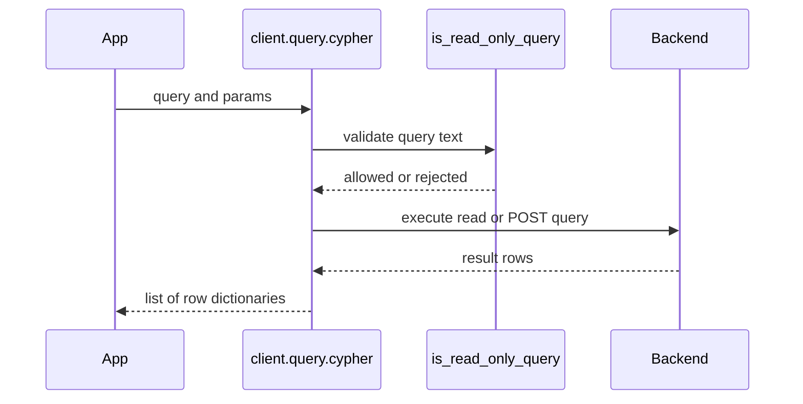

# Backends and safe Cypher querying

The SDK has two storage backends. `backend="bolt"` connects directly to Neo4j through the Python driver. `backend="nams"` connects to the hosted Neo4j Agent Memory Service through HTTP. Both are accessed through `MemoryClient`, but they deliberately do not expose identical operational capabilities.

## Capability matrix

| Capability | Bolt | NAMS |
| --- | --- | --- |
| Conversations and messages | Yes | Yes, conversation-scoped |
| Search messages | Yes, optionally session-scoped | Yes, requires a conversation `session_id` |
| Create/list conversations | Yes | Yes; use `list_conversations`, not `list_sessions` |
| Delete a single message | Yes | No |
| Entities | Full POLE+O entity model and client-side resolution/deduplication | Entity endpoints; type mapping into NAMS-supported types |
| Preferences, facts, relationship writes | Yes | No dedicated endpoint; protocol calls raise `NotSupportedError` |
| Reasoning traces | Persisted traces, steps, tool calls, and queryable tool stats | Flat hosted steps/tool calls; synthetic traces are cached client-side |
| Schema setup, graph adoption, raw graph export | Yes | No; schema is service-managed |
| Buffered writes and consolidation hygiene | Yes | No; hosted writes commit through the service |
| User-memory accessor | Yes | No; NAMS uses `userId` and API-key workspace scoping |
| `client.eval` | Yes | Yes, using public protocol calls |
| `client.query.cypher` | Yes, read-only | Yes, read-only |

## NAMS operational behavior

### Conversations, sessions, and extraction

NAMS has conversations rather than a separate session resource. The SDK uses its `session_id` parameter as the NAMS conversation identifier; `conversation_id` is accepted as an alias for short-term methods. Create or retain a conversation identifier in the application and pass it consistently.

NAMS entity extraction is asynchronous. A message write can succeed before extracted entities are searchable. `NamsLongTermMemory.wait_for_extraction()` avoids a fixed sleep:

```python
ready = await memory.long_term.wait_for_extraction(
    session_id=conversation_id,
    expected_names=["Lisbon"],
    timeout=30.0,
)
if not ready:
    # Retry later, return an in-progress response, or handle the timeout.
    pass
```

With a `session_id`, the helper first polls that conversation's extraction status until no message has an in-progress status. If a query, expected names, or predicate is also supplied, it then confirms the entity search condition. Use `expected_names` or a predicate when verifying a particular extraction: a generic minimum-result count can be satisfied by pre-existing workspace entities.

### Entity type adaptation

The self-hosted default entity model is POLE+O: `PERSON`, `OBJECT`, `LOCATION`, `EVENT`, and `ORGANIZATION`. NAMS supports lowercase `person`, `organization`, `location`, `concept`, `tool`, and `custom`. The adapter maps `PERSON`, `ORGANIZATION`, and `LOCATION` directly, maps `OBJECT` and `EVENT` to `custom`, and returns types uppercase to present a consistent package model.

NAMS creates entities with name, type, and optional description. Bolt-only entity inputs such as subtypes, aliases, attributes, explicit confidence, geocoding, enrichment, and local deduplication are not sent to the hosted entity endpoint.

### Reasoning caveat

NAMS records steps directly against a conversation and tool calls against a step. `start_trace()` creates a synthetic trace identifier in the local `NamsReasoningMemory` cache; later `add_step()` calls use that cached mapping to send hosted reasoning steps. The synthetic trace lifecycle is useful within the active client process, but it is not a first-class hosted Trace entity. Hosted trace retrieval is conversation-scoped.

## Unified read-only Cypher

Use `client.query.cypher()` for a custom inspection query that should work on either backend.

```python
rows = await memory.query.cypher(
    "MATCH (e:Entity) WHERE e.type = $type RETURN e.name AS name LIMIT $limit",
    {"type": "PERSON", "limit": 10},
)
```

On Bolt, `BoltCypherQuery` forwards validated queries to `Neo4jClient.execute_read`. On the configured REST endpoint, `NamsCypherQuery` sends `{"cypher": query, "params": params}` to `POST /v1/query` and returns the response rows. NAMS also enforces read-only behavior server-side.



This shows the shared client-side validation before the backend-specific read path.

### What the guard rejects

The shared `is_read_only_query()` validator uppercases the query and rejects text matching any of these write-capable patterns:

- `CREATE`
- `MERGE`
- `DELETE` or `DETACH DELETE`
- `SET`
- `REMOVE`
- `DROP`
- `LOAD CSV`
- `FOREACH`
- `CALL {` subqueries
- `IN TRANSACTIONS`

Rejected `client.query.cypher()` calls raise `ValueError` before a backend round trip. The MCP `graph_query` tool returns an error payload for the same rejected text. Use the memory-layer write APIs instead of trying to issue a graph write through this accessor.

The validation is a conservative keyword heuristic, not a complete Cypher parser. Ordinary read-only procedure calls such as `CALL db.index.vector.queryNodes(...)` and `CALL apoc...` are accepted because they are not a `CALL {` subquery. Treat accepted procedure calls as an authorization decision for the database and service configuration, not as proof of harmless behavior.

## Backend-aware implementation pattern

Use a common path for portable operations and explicitly branch for richer Bolt workflows:

```python
async with MemoryClient(settings) as memory:
    await memory.short_term.add_message(
        session_id=session_id,
        role="user",
        content=user_text,
    )

    entities = await memory.long_term.search_entities(user_text)

    if not memory.is_nams:
        await memory.long_term.add_preference(
            category="communication_style",
            preference="Prefers brief answers",
        )
```

This prevents a hosted deployment from invoking an unsupported preferences endpoint. Do not rely on auto-selection in environments where a stray `MEMORY_API_KEY` could change the backend unexpectedly; pin `MemorySettings(backend="bolt", ...)` or `MemorySettings(backend="nams", ...)` for production deployments.

## Source locations

| Concern | Source |
| --- | --- |
| Backend selection and unsupported accessors | `src/neo4j_agent_memory/__init__.py` |
| NAMS configuration and retry/connect controls | `src/neo4j_agent_memory/config/settings.py` |
| NAMS conversations and extraction status | `src/neo4j_agent_memory/nams/short_term.py` |
| NAMS entities and extraction waiting | `src/neo4j_agent_memory/nams/long_term.py` |
| NAMS reasoning adaptation | `src/neo4j_agent_memory/nams/reasoning.py` |
| Read-only validation and Bolt adapter | `src/neo4j_agent_memory/core/query.py` |
| NAMS query adapter | `src/neo4j_agent_memory/nams/query.py` |
