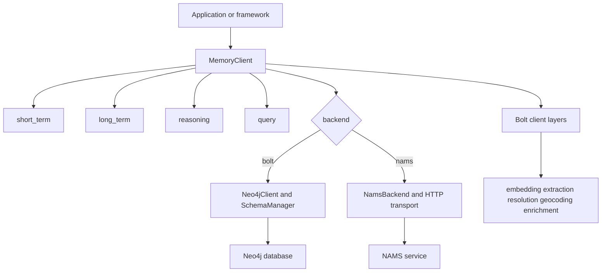

# Neo4j Agent Memory architecture

The Python SDK is organized around a single `MemoryClient` facade and four backend-neutral contracts: `ShortTermProtocol`, `LongTermProtocol`, `ReasoningProtocol`, and `CypherQueryProtocol`. At connection time, the client chooses concrete implementations from `MemorySettings.backend` and exposes them through `short_term`, `long_term`, `reasoning`, and `query`.

> **Scope:** this page describes the Python implementation under `src/neo4j_agent_memory/`. The repository also contains a separately released TypeScript SDK under `typescript/`.

## Component map

This shows the facade, protocol accessors, and the two storage paths selected during connection.

### Stable application surface

| Surface | Purpose | Portability notes |
| --- | --- | --- |
| `MemoryClient` | Async lifecycle and access to memory stores | Use `async with` or explicitly `connect()` and `close()` |
| `client.short_term` | Messages, conversations, retrieval, context | NAMS maps `session_id` to its conversation identifier |
| `client.long_term` | Entities and Bolt declarative memory | NAMS implements entity operations only; preferences, facts, and relationship writes are unavailable |
| `client.reasoning` | Traces, steps, and tool calls | NAMS adapts its flat conversation-scoped reasoning API into a synthetic trace lifecycle |
| `client.query.cypher` | Safe custom graph inspection | Always read-only; returns `list[dict[str, Any]]` |
| `MemoryIntegration` | Simplified application/MCP wrapper | Resolves session IDs and can trigger extraction/preference workflows |

The `client.graph` accessor is Bolt-only. Its `execute_read` method emits a one-time `DeprecationWarning`; prefer the portable `client.query.cypher(query, params)` for read queries. Direct graph access remains the route for Bolt-specific operations that are intentionally outside the portable API.

## Connection paths

### Bolt

The Bolt path creates a `Neo4jClient`, connects the Neo4j driver, constructs a `SchemaManager`, and calls `setup_all()`. It then initializes the client-side layers and wires `ShortTermMemory`, `LongTermMemory`, `ReasoningMemory`, `UserMemory`, `BufferedWriter`, `ConsolidationMemory`, `EvalMemory`, and `BoltCypherQuery`.

The schema manager creates unique constraints for memory nodes and regular/vector/point indexes. Its managed vector indexes cover embeddings for messages, entities, preferences, facts, reasoning-trace tasks, and reasoning steps. Existing managed vector dimensions are checked against the configured embedding provider at connection time.

### NAMS

The NAMS path lazily imports the HTTP backend, opens an `NamsBackend` transport, and performs an authenticated probe by default (`nams.validate_on_connect=True`). It wires NAMS implementations of the three memory protocols plus `NamsCypherQuery`.

Embedding, extraction, resolution, geocoding, and enrichment configuration are client-side Bolt layers. When present for NAMS, the client warns that those settings are ignored; the hosted service manages embedding, extraction, and resolution. The configured LLM provider remains available for client-side LLM workflows such as summarization.

Bolt-only accessors on NAMS return an unsupported sentinel that raises `NotSupportedError` when used: `users`, `buffered`, `consolidation`, `schema`, and `graph`. `eval` is available on both paths because it calls public protocol surfaces.

## Settings and provider resolution

`MemorySettings` is a Pydantic settings model. It accepts direct construction, `NAM_`-prefixed environment variables with `__` nested delimiters, and a `.env` source. The settings model resolves `backend` as follows:

1. It imports `MEMORY_API_KEY`, `MEMORY_ENDPOINT`, and `MEMORY_WORKSPACE_ID` into `nams` fields if those fields were not explicitly supplied.
2. An explicit `backend="bolt"` or `backend="nams"` wins.
3. Otherwise, a populated NAMS API key selects NAMS; absent one selects Bolt.

`embedding` and `llm` accept a provider-string shorthand or a provider object. `from_provider` uses native-first dispatch for OpenAI, Anthropic, and Bedrock LLMs and for OpenAI, Vertex AI, Bedrock, and sentence-transformers embeddings. If a matching native adapter is not available, it uses LiteLLM when installed. The older `EmbeddingConfig` and `LLMConfig` forms remain supported but warn when explicitly passed.

## Design implications

- **Prefer protocol methods for portable code.** They are the intentional common denominator between storage backends.
- **Treat backend-specific capabilities as branches.** Check `client.is_nams` or `client.backend` before selecting a workflow that needs raw graph writes, schema management, preferences, facts, or buffered writes.
- **Keep lifecycle ownership clear.** `MemoryIntegration(client=...)` does not close a supplied client. Without a client, it creates and owns a Bolt client from connection parameters.
- **Use explicit cleanup.** Closing a Bolt client drains buffered work before it closes the driver; closing a NAMS client closes its HTTP transport.

For the feature-by-feature decision table and read-only Cypher rules, see [Backends and querying](backends-and-querying.md). For the actual graph model, see [Memory model and operations](../memory/model-and-operations.md).

## Source locations

| Area | Primary implementation |
| --- | --- |
| Facade, backend selection, lifecycle | `src/neo4j_agent_memory/__init__.py` |
| Settings and environment resolution | `src/neo4j_agent_memory/config/settings.py` |
| Shared backend contracts | `src/neo4j_agent_memory/core/protocols.py` |
| Bolt driver and schema management | `src/neo4j_agent_memory/graph/client.py`, `src/neo4j_agent_memory/graph/schema.py` |
| Hosted backend and HTTP transport | `src/neo4j_agent_memory/nams/` |
| Provider factory and runtime contracts | `src/neo4j_agent_memory/llm/factory.py`, `src/neo4j_agent_memory/llm/protocol.py` |
