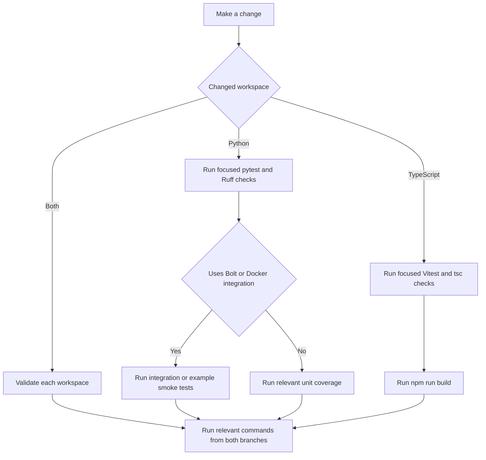

# Development environment and verification workflow

This repository contains two independently released SDKs that share a memory model and NAMS service but have separate workspaces and toolchains:

| Workspace | Package | Primary source | Package manager | Runtime baseline |
| --- | --- | --- | --- | --- |
| Python | `neo4j-agent-memory` | `src/neo4j_agent_memory/` | `uv` | Python 3.10+ |
| TypeScript | `@neo4j-labs/agent-memory` | `typescript/src/` | `npm` | Node.js 20+ |

Treat a change as belonging to one or both workspaces. Root `make` targets drive the Python workspace and provide convenience wrappers for the TypeScript workspace; the TypeScript `package.json` remains the authoritative definition of its own scripts.

## First-time setup

### Python SDK

Install the development dependency group for ordinary Python work:

```bash
uv sync --group dev
```

Run this broader installation before changing typed Python code in `src/`, `benchmarks/`, top-level `examples/*.py`, or an optional framework integration:

```bash
uv sync --all-extras --group dev
```

Both `mypy` and `ty` inspect that surface in CI. Installing all extras makes framework types available to the checkers rather than relying on absent or shallow imports.

`make install` runs `uv sync` and installs only core dependencies. `make install-dev` runs `uv sync --extra dev`; for the complete type-checking surface, use the explicit command above.

### TypeScript SDK

```bash
cd typescript
npm ci
```

`npm ci` uses `typescript/package-lock.json` for reproducible dependencies. The TypeScript package is built with `tsup` into `typescript/dist/`; its Node engine requirement is `>=20.0.0`.

### Database-backed work

Bolt integration tests and most complete example smoke tests need Docker. The repository's Compose service uses Neo4j `5.26-community`, exposes HTTP on `7474` and Bolt on `7687`, enables APOC, and keeps test data in named volumes.

```bash
make neo4j-start
make neo4j-wait
# work or test
make neo4j-stop
# remove the test volumes only when a clean database is intended
make neo4j-clean
```

Alternatively, `make test-integration` uses testcontainers and asks Docker to provision Neo4j. `make test-docker` and `make test-ci` use `docker-compose.test.yml` with its configured test credentials. Do not use those test settings for a shared or production database.

## Fast feedback and full validation

### Python commands

| Intent | Command | Scope and external requirements |
| --- | --- | --- |
| Format source and tests | `make format` | Modifies files with Ruff |
| Check lint and formatting | `make lint` then `make format-check` | `src` and `tests`; no database |
| Run strict static analysis | `make typecheck` and `make ty` | `src`, `benchmarks`, and `examples/*.py`; install all extras first |
| Run all Python quality checks | `make check` | Lint, format check, mypy, and ty |
| Run unit tests | `make test-unit` | `tests/unit`; no Docker required |
| Stop at first unit-test failure | `make test-quick` | Unit tests with concise traceback |
| Run one file | `make test-file FILE=tests/unit/test_config.py` | Any pytest target file |
| Filter by test name | `make test-match PATTERN="test_add_message"` | Searches `tests` |
| Run Bolt integration tests | `make test-integration` | Docker and testcontainers |
| Run MCP integration and end-to-end tests | `make test-integration-mcp` | Docker and testcontainers |
| Run all Python tests | `make test-all` | Docker and testcontainers |
| Run tests without integration tests | `make test-no-docker` | Sets `SKIP_INTEGRATION_TESTS=1` |
| Check documentation | `make test-docs` | Snippet syntax, links, and build-oriented checks |

`make pre-commit` runs formatting, linting, both type checkers, and unit tests. `make ci` adds the full test suite, so it requires Docker; `make ci-no-docker` is the corresponding quality plus unit-test check.

### TypeScript commands

Use the root wrappers or run the equivalent `npm` script from `typescript/`:

| Intent | Root command | Direct command | Notes |
| --- | --- | --- | --- |
| Install dependencies | `make ts-install` | `npm ci` | Uses the TypeScript lockfile |
| Type check | `make ts-lint` | `npm run lint` | Runs `tsc --noEmit` |
| Run unit tests | `make ts-test-unit` | `npm run test:unit` | Vitest unit suite |
| Run unit plus integration tests | `make ts-test` | `npm test` | Vitest `test/unit` and `test/integration` |
| Build package | `make ts-build` | `npm run build` | Validates version sync, then runs `tsup` |
| Inspect npm package contents | `make ts-pack` | `npm pack --dry-run` | Does not publish |
| Type check all shipped examples | `make ts-test-examples` | See Makefile loop | Builds first, then checks five example projects |
| Run local TCK bridge | `make ts-conformance` | `npm run conformance:server` | Default `TCK_BRIDGE_PORT` is `3001` |

The TypeScript `test:e2e` and `test:tck` scripts exist but are not part of the ordinary `npm test` command. Hosted end-to-end tests require an authorized NAMS key and are separately automated in `.github/workflows/e2e-typescript.yml`.

## Select validation by change



This decision flow starts with targeted validation and adds infrastructure-dependent checks only when the changed behavior needs them.

Examples:

- A query-template or configuration change normally merits its targeted `tests/unit` file, then `make test-unit` if practical.
- A Bolt graph or MCP server change needs an integration or end-to-end MCP check in addition to unit tests.
- A TypeScript public API or export change needs `npm run lint`, unit tests, `npm run build`, and the affected example type checks.
- A change to published documentation should include the relevant `make test-docs-*` target; a documentation build needs Node dependencies under `docs/`.

## CI topology

### Python CI

`.github/workflows/ci-python.yml` runs on pushes and pull requests to `main` when Python sources, tests, examples, documentation, build configuration, or the workflow itself changes. It includes:

- Ruff lint and format checks on Python 3.12;
- strict mypy and `ty` checks on Python 3.12 with all extras installed;
- unit tests on Python 3.10, 3.11, 3.12, and 3.13, with coverage recorded from 3.12;
- Bolt integration tests on a GitHub Actions Neo4j service, followed by the other Python-version matrix;
- complete and quick example smoke-test jobs;
- documentation syntax, link, and build-pipeline tests using Node 20; and
- an `uv build` packaging job.

The workflow also combines unit and integration coverage and emits a warning if the merged report is below 55 percent; the threshold step is intentionally non-blocking.

### Hosted-service checks

Python NAMS integration tests live in `tests/integration/nams/` and have a dedicated workflow, `.github/workflows/nams-integration.yml`. It runs smoke and lifecycle tests first, reports TCK tiers and error paths independently, then runs a consolidated suite that controls the final status. The workflow skips cleanly if its NAMS secret is unavailable, but it requires an appropriate workspace configuration when the selected deployment is workspace-scoped.

TypeScript hosted-service end-to-end tests are in `typescript/test/e2e/`. `.github/workflows/e2e-typescript.yml` skips them when `MEMORY_API_KEY` is unavailable; otherwise it builds the SDK and runs the hosted-service and Strands suites against the configured endpoint.

### TypeScript CI

`.github/workflows/ci-typescript.yml` tests Node 20 and 22. For each runtime it runs `npm ci`, `npm run lint`, unit tests, integration tests, the package build, and `npm pack --dry-run`. A follow-on matrix builds the SDK and type-checks the LangChain, Mastra, MCP, Strands, and Vercel AI example projects. The workflow also validates the separate Vercel AI provider package under `typescript/packages/vercel-ai-provider/`.

## Contribution and release constraints

The Python checker configuration is strict. Prefer precise types, `TYPE_CHECKING` imports, and protocol or generic types at framework boundaries. A `# type: ignore` must include a specific diagnostic code and a reason; do not use a bare ignore to conceal a new incompatibility.

Documentation follows the Diataxis distinction described in `CONTRIBUTING.md`: tutorials teach, how-to guides accomplish a task, references look up a surface, and explanations describe design. Public API changes should update references; user-facing workflows should have a how-to; architectural changes should have an explanation.

The packages release independently:

| Package | Version source | Required tag prefix | Publish destination |
| --- | --- | --- | --- |
| `neo4j-agent-memory` | root `pyproject.toml` | `python-v*` | PyPI |
| `@neo4j-labs/agent-memory` | `typescript/package.json` and `typescript/CHANGELOG.md` | `typescript-v*` | npm |

Plain `v*` tags do not invoke the publish workflows. Use the package-specific tags only after the package version and, for TypeScript, its changelog are updated.

## Important paths

| Concern | Location |
| --- | --- |
| Python package metadata and quality configuration | `pyproject.toml` |
| Root task entry points | `Makefile` |
| Python CI | `.github/workflows/ci-python.yml` |
| NAMS live integration CI | `.github/workflows/nams-integration.yml` |
| TypeScript scripts and exports | `typescript/package.json` |
| TypeScript CI | `.github/workflows/ci-typescript.yml` |
| TypeScript hosted end-to-end CI | `.github/workflows/e2e-typescript.yml` |
| Contribution conventions | `CONTRIBUTING.md` |
| NAMS test-suite runbook | `tests/integration/nams/README.md` |
