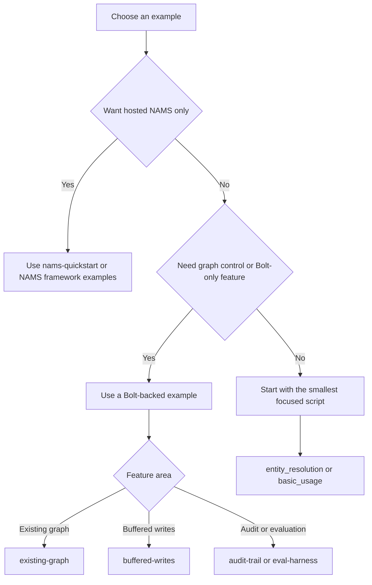

# Choosing, running, and validating examples

The repository's `examples/` directory is a set of runnable Python demonstrations, from small scripts to full-stack and multi-agent applications. `typescript/examples/` contains independently installable examples for the NAMS-focused TypeScript SDK. Examples are useful reference implementations, but their credentials and infrastructure requirements vary; choose the smallest example that proves the behavior you need.

## Choose by goal

| Goal | Recommended example | Backend and major requirements |
| --- | --- | --- |
| Start with hosted NAMS and no Neo4j | `examples/nams-quickstart/` | NAMS API key; hosted extraction and embeddings |
| Put NAMS memory in a FastAPI service | `examples/nams-fastapi/` | NAMS API key |
| Use NAMS with a LangChain agent | `examples/nams-langchain/` | NAMS API key and LangChain dependencies |
| Learn the three Python memory domains | `examples/basic_usage.py` | Bolt Neo4j and a configured embedding/LLM route |
| Test entity matching without a database | `examples/entity_resolution.py` | No Neo4j required |
| Enrich entities | `examples/enrichment_example.py` | Neo4j; optional external provider setup for some enrichment |
| Run without an LLM | `examples/no_llm/` | Local sentence-transformers, spaCy, and GLiNER configuration |
| Use a pre-existing Neo4j graph | `examples/existing-graph/` | Bolt Neo4j |
| Keep response latency off the Bolt write path | `examples/buffered-writes/` | Bolt Neo4j |
| Create reasoning audit edges and evaluate quality | `examples/audit-trail/` and `examples/eval-harness/` | Bolt Neo4j |
| Tailor extraction schemas | `examples/domain-schemas/` | GLiNER dependencies; Neo4j is optional for some flows |
| Integrate a framework | `examples/langchain_agent.py`, `examples/pydantic_ai_agent.py`, `examples/google_adk_demo/`, `examples/google_cloud_integration/` | Framework-specific extras and configuration |
| Study a full-stack reference application | `examples/full-stack-chat-agent/` or `examples/lennys-memory/` | Neo4j, Node.js, and application-specific configuration |
| Study a multi-agent compliance workflow | `examples/financial-services-advisor/` | Neo4j Aura plus cloud/framework requirements |
| Use the TypeScript SDK | `typescript/examples/` | Node.js 20+ and NAMS API key |

The Python `examples/README.md` is the canonical detailed index. It also identifies full-stack applications and describes their separate requirements.

## Backend decision



This decision flow distinguishes the managed NAMS examples from examples that rely on direct Neo4j features unavailable on the hosted backend.

For a capability comparison, see [Backends and safe Cypher querying](architecture/backends-and-querying.md). NAMS has no product tiers; Bronze, Silver, Gold, and Platinum are conformance tiers used by the cross-language TCK, not service plans.

## Run Python examples safely

The usual entry point is `uv run python`:

```bash
uv run python examples/entity_resolution.py
uv run python examples/nams-quickstart/main.py
```

Some root Makefile shortcuts load `examples/.env` when present and otherwise start the repository's test Docker Neo4j container for the selected Bolt example:

```bash
make example-resolution
make example-basic
make example-langchain
make example-pydantic
```

The example environment template is `examples/.env.example`. Create your local copy and populate it through your local secret-management practice; do not commit it. For an existing Neo4j instance, configure its URI and authentication in that local configuration. Hosted NAMS examples need `MEMORY_API_KEY`; the backend auto-selects NAMS when the key is available unless the example explicitly pins backend selection.

Examples are async-first: use `asyncio.run(...)` in a script and `await` in an existing asynchronous environment. `async with MemoryClient(settings)` is the standard lifecycle. `add_entity()` returns `(entity, deduplication_result)`, not a single entity.

## TypeScript examples

The five TypeScript examples are under `typescript/examples/`:

| Directory | Shows |
| --- | --- |
| `vercel-ai/` | Vercel AI SDK memory middleware |
| `mcp/` | A self-hosted stdio MCP wrapper around the 12 NAMS memory tools |
| `langchain/` | Chat history and entity retriever shapes for LangChain JS |
| `mastra/` | A Mastra-compatible memory provider |
| `strands/` | AWS Strands session persistence, three-tier context, and reasoning capture |

Each project uses an in-tree `file:../..` dependency during repository development. To adapt one to a separate application, replace that local dependency with a published `@neo4j-labs/agent-memory` version. Install dependencies within the selected example and provide `MEMORY_API_KEY` locally before running it.

The TypeScript MCP example is not the Python command-line FastMCP server. It has 12 tools shaped for the hosted service, while the Python server supports separate core and extended profiles. See [MCP server](integrations/mcp-server.md) for the Python server and [TypeScript SDK for the hosted memory service](typescript-sdk.md) for TypeScript MCP behavior.

## Example validation in CI

Examples are protected against API drift in two ways:

| Check | Command | What it proves |
| --- | --- | --- |
| Quick Python examples | `make test-examples-quick` | Structure/import/API validation for selected examples, without Neo4j |
| Complete Python examples | `make test-examples` | Smoke tests under `tests/examples`, with Docker/testcontainers available |
| Individual example no-DB subset | `make test-examples-no-neo4j` | Entity resolution and full-stack application structural checks |
| TypeScript example type matrix | `make ts-test-examples` | Builds the SDK and runs `tsc --noEmit` in each of the five TypeScript examples |

Python CI runs a quick example job and a complete Neo4j-backed example job. TypeScript CI builds `typescript/dist/`, installs each example without a package lock, and type-checks it. Passing a type check does not run a hosted example against NAMS; that still requires credentials and a deployed service.

## Source map

| Topic | Location |
| --- | --- |
| Full Python example index | `examples/README.md` |
| Python example tests | `tests/examples/` |
| Example task shortcuts | `Makefile` |
| TypeScript example index | `typescript/examples/README.md` |
| TypeScript example CI | `.github/workflows/ci-typescript.yml` |
| Python example CI | `.github/workflows/ci-python.yml` |
