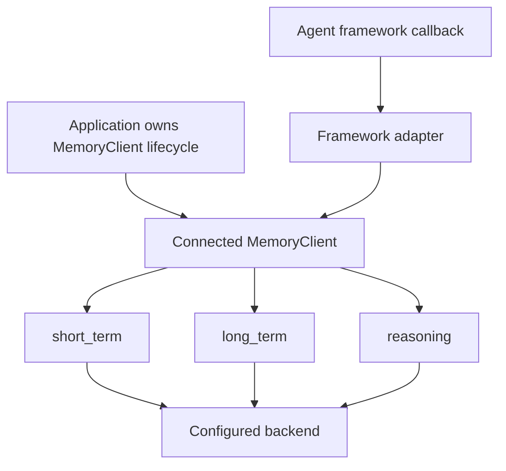

# Python framework adapters and async boundaries

The Python package integrates the three memory domains into framework-specific abstractions. The common architectural rule is that an integration consumes a connected `MemoryClient`; the application retains responsibility for creating and closing that client unless a particular constructor explicitly owns one. All memory APIs remain asynchronous even where an adapter offers a synchronous framework-facing method.

This shows the normal ownership boundary: adapters shape calls for a framework, while the configured client remains the gateway to memory operations.

## Install optional integrations deliberately

The root package does not install every framework SDK. Install the matching extra before importing the associated adapter:

| Framework | Package extra | Main Python import | Primary role |
| --- | --- | --- | --- |
| LangChain | `[langchain]` | `neo4j_agent_memory.integrations.langchain` | Memory variables and entity retrieval |
| Pydantic AI | `[pydantic-ai]` | `neo4j_agent_memory.integrations.pydantic_ai` | Dependency object, memory tools, trace capture |
| Google ADK | `[google-adk]` | `neo4j_agent_memory.integrations.google_adk` | ADK memory service |
| AWS Strands | `[strands]` | `neo4j_agent_memory.integrations.strands` | Context-graph tools and session manager |
| CrewAI | `[crewai]` | `neo4j_agent_memory.integrations.crewai` | Crew memory interface |
| LlamaIndex | `[llamaindex]` | `neo4j_agent_memory.integrations.llamaindex` | LlamaIndex `BaseMemory` implementation |
| OpenAI Agents | `[openai-agents]` | `neo4j_agent_memory.integrations.openai_agents` | Context, function tools, and agent trace recording |
| Microsoft Agent Framework | `[microsoft-agent]` | `neo4j_agent_memory.integrations.microsoft_agent` | Context provider, chat store, tools, and tracing |
| AWS Bedrock AgentCore | no declared package extra | `neo4j_agent_memory.integrations.agentcore` | Context-graph-backed memory provider |

Framework imports are commonly guarded so the package can be installed without all framework dependencies. A missing optional framework can therefore limit the symbols exported by that integration module rather than affecting core `MemoryClient` use. Test an integration in an environment that includes both its extra and the provider/backend extras it requires.

## What each adapter provides

### LangChain

`Neo4jAgentMemory` provides LangChain-style synchronous `load_memory_variables`, `save_context`, and `clear` methods backed by an asynchronous client. Depending on its `include_short_term`, `include_long_term`, and `include_reasoning` flags, it supplies:

- conversation history;
- long-term context and preferences; and
- similar past reasoning tasks.

It supports configurable message, preference, and trace limits. `Neo4jMemoryRetriever`, when `langchain_core` is available, provides a retriever surface. `llm_provider_from_langchain()` adapts an already-configured LangChain model to the package `LLMProvider` contract.

### Pydantic AI

`MemoryDependency` is a natural `deps_type` value. It exposes async `get_context`, `save_interaction`, `add_preference`, and `search_preferences` functions for a specified session. `create_memory_tools(client)` produces agent-callable memory tools for multi-domain search, saving a preference, and recalling preferences. `record_agent_trace()` translates a completed Pydantic AI run into a reasoning trace and can record its tool calls.

`nams_memory_tools` is also exported by the integration for hosted use. Since preferences are unsupported on NAMS through the portable Python protocol, keep tools that write or search preferences on the Bolt path and choose backend-aware tool sets in hosted deployments.

### Google ADK

`Neo4jMemoryService` adapts a connected client as an ADK memory service. `llm_provider_from_google_adk()` accepts an ADK/Gemini model: a bare string is resolved through the `vertex_ai/` provider prefix, while an object is inspected by the shared pass-through adapter. The `examples/google_adk_demo/` and `examples/google_cloud_integration/` directories provide runnable reference configurations.

### AWS Strands

`context_graph_tools()` builds tools for the self-hosted/Bolt path. `nams_context_graph_tools()` is the hosted counterpart. The integration also exports `StrandsConfig`, Bedrock model constants, `Neo4jSessionManager`, and `Neo4jRetrievalConfig`.

The synchronous Strands session manager uses the shared `AsyncBridge`: it maintains one background event loop for a long-lived client, rather than starting a fresh event loop for each callback. Flush and close the manager according to its lifecycle so work completes before its bridge stops. Use `llm_provider_from_strands()` to turn a bare Strands Bedrock model ID into a `bedrock/` provider string or adapt a framework object.

### CrewAI and LlamaIndex

`Neo4jCrewMemory` implements CrewAI's memory methods. It can store a short-term message, a fact, or a preference based on metadata and retrieves messages, entities, and preferences for a query. That fact/preference behavior requires the Bolt backend.

`Neo4jLlamaIndexMemory` implements LlamaIndex `BaseMemory`, including synchronous and asynchronous methods. It converts memory records back to `ChatMessage` objects and preserves serializable message metadata. When reconstructing tool calls, it removes incomplete assistant tool-call/tool-response pairs so downstream model APIs do not receive invalid conversation history. It can add semantic short-term results and long-term entities as system context to its session history.

### OpenAI Agents and Microsoft Agent Framework

`Neo4jOpenAIMemory` supplies session-based context; `create_memory_tools()` provides functions for an OpenAI Agents workflow; and `record_agent_trace()` writes a reasoning trace from agent messages.

The Microsoft integration has more components:

| Export | Role |
| --- | --- |
| `Neo4jContextProvider` | Injects graph-enhanced memory context into an agent |
| `Neo4jChatMessageStore` | Persists chat history for a session |
| `Neo4jMicrosoftMemory` | Combines the integration around a `MemoryClient` |
| `create_memory_tools` and `execute_memory_tool` | Tool definitions and dispatch |
| `record_agent_trace`, `get_similar_traces`, `format_traces_for_prompt` | Reasoning capture and retrieval |
| `GDSConfig`, `GDSAlgorithm`, `GDSIntegration` | Graph Data Science integration configuration |

The Microsoft adapter targets Microsoft Agent Framework version `1.0.0b260212`, which is also the minimum version stated by its module.

### AWS Bedrock AgentCore

`Neo4jMemoryProvider` is an asynchronous provider that maps a memory type to the appropriate client domain:

| `memory_type` | Write destination |
| --- | --- |
| `message` | `short_term.add_message` with optional extraction and embeddings |
| `preference` | `long_term.add_preference` |
| `fact` | `long_term.add_fact` |

It adds its configured `namespace` to message metadata and supports a hybrid query across messages, entities, and preferences. As implemented, it reaches the connected underlying Neo4j client and uses preference/fact APIs, so it is a Bolt-oriented integration rather than a portable NAMS abstraction. `HybridMemoryProvider` and `RoutingStrategy` are exported for AgentCore routing scenarios.

## LLM-provider pass-through helpers

Several integrations export `llm_provider_from_<framework>()`. These helpers let memory configuration reuse a model already configured for the host framework instead of duplicating provider setup. They inspect known model names or attributes, then construct an `LLMProvider` through the shared pass-through machinery.

| Helper | Special handling |
| --- | --- |
| `llm_provider_from_langchain` | Uses LangChain model metadata and class naming to identify provider/model |
| `llm_provider_from_pydantic_ai` | Uses the Pydantic AI model name and class naming |
| `llm_provider_from_google_adk` | Bare strings become `vertex_ai/<model>` |
| `llm_provider_from_strands` | Bare strings become `bedrock/<model>` |
| `llm_provider_from_crewai` | Reads the CrewAI/LiteLLM model configuration |
| `llm_provider_from_llamaindex` | Reads LlamaIndex LLM metadata |
| `llm_provider_from_openai_agents` | Bare strings become `openai/<model>` |
| `llm_provider_from_microsoft_agent` | Reads underlying Azure OpenAI or OpenAI client metadata |

Provider resolution is a Bolt-side client feature. NAMS performs extraction and embeddings server-side and warns when those client-side layer settings are supplied. See [Backends and safe Cypher querying](../architecture/backends-and-querying.md) before choosing a hosted workflow.

## Async and session rules

1. **Create one client per application lifecycle.** Prefer `async with MemoryClient(settings) as client:` for an async application. When a framework asks for an adapter, pass that active client into it.
2. **Avoid closing a client that an adapter did not create.** In particular, `MemoryIntegration(client=...)` does not own the supplied client.
3. **Use a stable application session or conversation ID.** Framework wrappers use it to locate conversation history and associate reasoning; do not generate a new identifier on every turn unless each turn really is isolated.
4. **Do not assume all integration methods are portable.** Adapters that call preferences, facts, raw graph, Graph Data Science, client-side extraction, or direct Neo4j access require Bolt. Branch on `client.is_nams`/`client.backend` or choose a NAMS-specific adapter before calling them.
5. **Treat framework bridges as blocking adapters.** Synchronous callbacks can wait on asynchronous I/O. Do not call a framework's synchronous interface from a latency-critical path without understanding its event-loop and timeout behavior.

## Examples and source map

| Need | Reference |
| --- | --- |
| LangChain agent | `examples/langchain_agent.py` |
| Pydantic AI agent | `examples/pydantic_ai_agent.py` |
| Google ADK service | `examples/google_adk_demo/` and `examples/google_cloud_integration/` |
| Microsoft Agent retail application | `examples/microsoft_agent_retail_assistant/` |
| AWS Strands workflow | `examples/financial-services-advisor/` and `examples/strands-session-manager/` |
| Framework adapter source | `src/neo4j_agent_memory/integrations/` |
| Shared sync/async bridge | `src/neo4j_agent_memory/integrations/base.py` |
| Backend capability limits | [Backends and safe Cypher querying](../architecture/backends-and-querying.md) |
