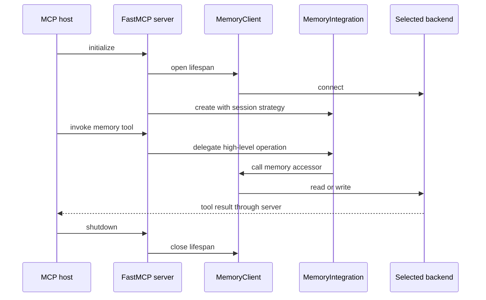

# Model Context Protocol server

The optional MCP integration exposes Neo4j Agent Memory to MCP-compatible hosts through FastMCP. It provides tools for memory reads and writes, resources for injectable context, and prompts that guide memory-aware workflows.

Install the optional dependency first:

```bash
pip install "neo4j-agent-memory[mcp]"
```

## Run the server

The CLI entry point is `neo4j-agent-memory mcp serve`.

```bash
# Local MCP host using stdio and a self-hosted Bolt database
neo4j-agent-memory mcp serve --transport stdio --password "$NEO4J_PASSWORD"

# Network deployment using SSE
neo4j-agent-memory mcp serve \
  --transport sse \
  --host 127.0.0.1 \
  --port 8080 \
  --password "$NEO4J_PASSWORD"

# Hosted backend using an environment-provided NAMS key
neo4j-agent-memory mcp serve --backend nams --transport stdio
```

The CLI accepts `stdio`, `sse`, and `http` transports. `stdio` is the default and is the normal choice for a local desktop or coding-agent host. For a network transport, bind deliberately: the default host is `127.0.0.1`, while `0.0.0.0` exposes the server on all interfaces.

The CLI resolves a backend from `--backend` or `NAM_BACKEND`. Without an explicit setting, it selects NAMS when an API key is provided and Bolt otherwise. A Bolt server requires a Neo4j password; a NAMS server requires `MEMORY_API_KEY` or `--api-key`. Keep credentials in the host environment or its secret storage rather than an MCP configuration file committed to source control.

Useful configuration options:

| Option | Default | Meaning |
| --- | --- | --- |
| `--profile` | `extended` | Choose `core` or `extended` tools/resources/prompts |
| `--session-strategy` | `per_conversation` | `per_conversation`, `per_day`, or `persistent` session resolution |
| `--user-id` | unset | User identity used by `per_day` and `persistent` strategies |
| `--observation-threshold` | `30000` | Approximate token threshold for observer-driven compression |
| `--no-auto-preferences` | off | Disables background preference detection for user messages |
| `--llm` / `--embedding` | unset | Provider strings passed through the provider factory |
| `--embedding-dimensions` | unset | Override dimensions for an embedding model missing from defaults |

## Server lifecycle

`create_mcp_server(settings, ...)` is the preferred programmatic factory. It opens a `MemoryClient` inside FastMCP's lifespan, creates a `MemoryIntegration`, and attaches a `MemoryObserver`. `Neo4jMemoryMCPServer` remains as a wrapper for callers that already own a connected client.



This shows how FastMCP owns a configured client for the lifetime of a server created by `create_mcp_server`.

`memory_store_message` delegates to `MemoryIntegration.store_message`. With its default settings, it stores the message with entity extraction enabled, starts background preference detection for user messages, and notifies the observer in a background task. Those background follow-ups log errors rather than failing the tool response.

## Profiles and tools

The `core` profile contains six essential tools:

| Tool | Operation |
| --- | --- |
| `memory_search` | Search messages, entities, preferences, and optionally traces |
| `memory_get_context` | Return assembled short-term, long-term, and reasoning context |
| `memory_store_message` | Store a conversation message |
| `memory_add_entity` | Add or update an entity through the integration layer |
| `memory_add_preference` | Store a categorized user preference |
| `memory_add_fact` | Store a temporal subject-predicate-object fact |

`extended` adds the following ten tools, for sixteen tools total:

| Tool | Operation |
| --- | --- |
| `memory_get_conversation` | Return chronological messages for one session |
| `memory_list_sessions` | List session previews with pagination |
| `memory_get_entity` | Find an entity and optionally traverse up to three graph hops |
| `memory_export_graph` | Export nodes and relationships for visualization |
| `memory_create_relationship` | Resolve two entities by name and create a typed relationship |
| `memory_start_trace` | Begin a reasoning trace for a task |
| `memory_record_step` | Add thought/action/observation and optional tool-call data |
| `memory_complete_trace` | Record trace outcome and success |
| `memory_get_observations` | Return observer reflections, observations, and session statistics |
| `graph_query` | Run a read-only custom Cypher query |

Tools are annotated as read-only or write operations for hosts that use MCP tool annotations. The server registers the same broad profiles for both backends, but a tool that calls a Bolt-only method can return an error on NAMS. In particular, NAMS does not implement first-class preferences, facts, relationship writes, session listings, or the Bolt graph export. Select NAMS-specific entity and conversation workflows when targeting the hosted backend.

When the profile is `extended` **and** the configured backend is NAMS, the server also registers four hosted Platinum tools:

- `memory_set_entity_feedback`
- `memory_get_entity_history`
- `memory_get_entity_provenance`
- `memory_get_reflections`

## Safe graph inspection

`graph_query` calls the shared `is_read_only_query()` guard and then `client.query.cypher()`. It allows `MATCH`/`RETURN` queries and regular read-only procedure calls, but rejects text that includes write-capable patterns such as `CREATE`, `MERGE`, `DELETE`, `SET`, `REMOVE`, `DROP`, `LOAD CSV`, `FOREACH`, `CALL {`, or `IN TRANSACTIONS`.

Use a memory tool for mutation rather than attempting a write query. See [Backends and safe Cypher querying](../architecture/backends-and-querying.md) for the complete behavior and why accepted query text is not a substitute for database authorization.

## Resources and prompts

### Resources

| Profile | Resource | Returned content |
| --- | --- | --- |
| Core | `memory://context/{session_id}` | A JSON envelope containing assembled context for a session |
| Extended | `memory://entities` | Up to 100 entity records from an empty-query entity search |
| Extended | `memory://preferences` | Up to 100 preference records from an empty-query preference search |
| Extended | `memory://graph/stats` | Counts grouped by graph-node labels from a read-only Cypher query |

The extended entity and preference catalog resources inherit backend limitations. In a hosted NAMS deployment, a preference catalog is not supported because NAMS exposes no preferences endpoint.

### Prompts

| Profile | Prompt | Guided workflow |
| --- | --- | --- |
| Core | `memory-conversation` | Load context, store important messages, and record learned preferences/entities |
| Extended | `memory-reasoning` | Start a trace, record significant steps and tool calls, then complete it |
| Extended | `memory-review` | Browse stored knowledge and request a contradiction/outdated-information review |

The prompts guide a host model; they do not perform mutations on their own. Treat their recommended tools as subject to the same backend capability rules above.

## Observational memory

The observer keeps in-process state per session. It estimates token count as characters divided by four. After the total exceeds its threshold and at least the configured recent-message window has passed since the last compression, it fetches the conversation and generates a reflection over older messages.

With an `LLMProvider`, the observer requests a concise summary. Without one, or after a provider error, it falls back to keyword/entity heuristics. It retains recent messages in full and returns reflections, inline observations from user-message markers, and counts through `memory_get_observations`. This is server-process state rather than a separate persistent graph model.

## Programmatic construction

```python
from neo4j_agent_memory import MemorySettings
from neo4j_agent_memory.mcp.server import create_mcp_server

settings = MemorySettings(backend="bolt", neo4j={"password": "from-secret-storage"})
server = create_mcp_server(
    settings,
    profile="core",
    session_strategy="persistent",
    user_id="application-user",
)
```

Do not embed a real password in code as in the placeholder above. The factory returns a configured FastMCP application; FastMCP controls how the selected transport is run.

## Source locations

| Concern | Source |
| --- | --- |
| Server factory, lifespan, transports | `src/neo4j_agent_memory/mcp/server.py` |
| Tool registrations and backend-gated hosted tools | `src/neo4j_agent_memory/mcp/_tools.py` |
| Resources | `src/neo4j_agent_memory/mcp/_resources.py` |
| Prompts | `src/neo4j_agent_memory/mcp/_prompts.py` |
| Observer | `src/neo4j_agent_memory/mcp/_observer.py` |
| High-level tool delegation and session strategies | `src/neo4j_agent_memory/integration.py` |
| CLI options | `src/neo4j_agent_memory/cli/main.py` |
