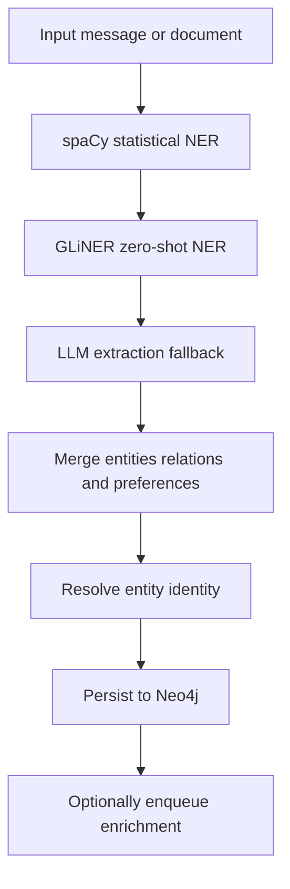

# Bolt extraction, entity resolution, and enrichment

On the self-hosted Bolt backend, `MemoryClient` can enrich messages and direct entity writes with three client-side layers:

1. **Extraction** turns text into `ExtractedEntity`, `ExtractedRelation`, and `ExtractedPreference` records.
2. **Resolution** chooses a canonical identity for an extracted entity before persistence.
3. **Enrichment** optionally fetches external facts for persisted entities in the background.

These are Bolt client features. NAMS manages extraction, embedding, and resolution server-side, and the Python client warns when these layer settings are supplied for NAMS. Use the NAMS API's asynchronous extraction status and entity endpoints rather than assuming that a local extractor configuration changes hosted behavior.

## Extraction pipeline

`ExtractionConfig` defaults to a multi-stage pipeline. The factory attempts the stages in this order:



This is the default Bolt-side pipeline order; unavailable optional stages are skipped and an empty stage list becomes a `NoOpExtractor`.

| Extractor type | Role | Requirements and notes |
| --- | --- | --- |
| `PIPELINE` | Configurable multi-stage extraction | Default `ExtractionConfig` type |
| `SPACY` | Fast statistical named-entity recognition | Install `[spacy]` and an appropriate spaCy language model |
| `GLINER` | Zero-shot, custom-label named-entity recognition | Install `[gliner]`; supports named domain schemas |
| `LLM` | Model-driven entity, relation, and preference extraction | Requires a usable LLM configuration |
| `NONE` | Disables extraction | Uses `NoOpExtractor` |

The default pipeline enables spaCy, GLiNER, and LLM fallback. Its default `fallback_on_empty=True` means it continues to later stages instead of stopping after a non-empty earlier stage; if a configured stage cannot be created, the factory logs a warning and tries the remaining stages.

`ExtractionPipeline` supports `UNION`, `INTERSECTION`, `CONFIDENCE`, `CASCADE`, and `FIRST_SUCCESS` merge strategies. Entity identity within a pipeline is normalized name plus type; union and confidence-based merging retain the highest-confidence duplicate. Relations are de-duplicated by source, relation type, and target. Preferences are de-duplicated by category and preference text.

### Configure a local no-LLM path

A self-hosted deployment can keep both extraction and embeddings local. When `llm=None`, disable LLM fallback as well; otherwise `MemorySettings` rejects the incompatible combination.

```python
from neo4j_agent_memory import MemorySettings
from neo4j_agent_memory.config import ExtractionConfig, ExtractorType

settings = MemorySettings(
    llm=None,
    embedding="sentence-transformers/all-MiniLM-L6-v2",
    extraction=ExtractionConfig(
        extractor_type=ExtractorType.PIPELINE,
        enable_spacy=True,
        enable_gliner=True,
        enable_llm_fallback=False,
    ),
)
```

This needs the matching extras—at minimum `neo4j-agent-memory[extraction,sentence-transformers]`—and a downloaded spaCy model when spaCy is enabled. `examples/no_llm/main.py` is the runnable reference. The integration suite verifies both that `get_context()` works on an `llm=None` path and that this configuration does not import the OpenAI SDK along the LLM-extraction path.

### Domain schemas and long documents

A GLiNER domain schema can replace generic labels with typed descriptions. Built-in schema names include `poleo`, `podcast`, `news`, `scientific`, `business`, `entertainment`, `medical`, and `legal`. Custom `SchemaConfig` entity types also feed GLiNER labels and LLM entity type selection. The Bolt schema persistence layer can save, activate, and load versioned graph schemas; see the `schemas` CLI command and `src/neo4j_agent_memory/schema/` for the persistence surface.

For large inputs, `StreamingExtractor` chunks a document, yields per-chunk results asynchronously, adjusts entity spans to document offsets, then can return a cross-chunk de-duplicated aggregate. Defaults are 4,000 characters with 200-character overlap, or approximately 1,000 tokens with 50-token overlap when token chunking is selected. Streaming extraction turns off preference extraction for individual chunks because preferences generally require whole-document context.

`ExtractionPipeline.extract_batch()` processes text batches with a configurable concurrency cap, progress callback, and `fail_fast` choice. Its result includes per-item successes/errors and aggregate entity/relation counts.

## Entity resolution and persistence

The default `ResolutionConfig` strategy is `COMPOSITE`. `CompositeResolver` attempts exact, fuzzy, then semantic matching and returns the first canonical match:

| Strategy | Default availability | Default threshold |
| --- | --- | --- |
| Exact | Always available | 1.0 |
| Fuzzy | Available when RapidFuzz can be imported | 0.85 |
| Semantic | Available when an embedder is configured | 0.8 |

Resolution is type-aware by default. With type information, a `PERSON` named `John` is not matched with a `LOCATION` named `John`. Batch resolution also carries already-resolved canonical names forward so repeated same-type mentions can share an identity.

Resolution is distinct from the later deduplication policy performed by long-term memory. `add_entity()` may normalize type, consult the resolver, check persisted duplicates, and return an existing entity with a `DeduplicationResult`. Do not interpret an extracted name as a guaranteed new graph node.

## Background enrichment

`EnrichmentConfig.enabled` is `False` by default. When enabled on the Bolt path, `create_enrichment_service()` builds providers in configured priority order, optionally wraps each in an in-memory TTL cache, and returns either one provider or a `CompositeEnrichmentProvider` fallback chain.

| Provider | Credentials | Default delay between provider calls |
| --- | --- | --- |
| Wikimedia/Wikipedia | None | 0.5 seconds |
| Diffbot knowledge graph | Diffbot API key | 0.2 seconds |

The background service uses a bounded priority queue. It does not block the original extraction/store flow. An entity is skipped when it is already pending, the queue is full, its confidence is below `min_confidence`, its type is filtered out, or the provider does not support it. Defaults include a queue size of 1,000, minimum confidence 0.7, at most 3 retries, and a 60-second retry delay.

When a provider returns usable data, the service updates the matched `:Entity` with `enriched_description`, `enriched_at`, `enrichment_provider`, and serialized `enrichment_data`. Its optional callback is isolated: callback errors are logged rather than stopping the worker. Rate-limited or failing work is re-queued until its retry limit; graceful `stop()` waits for the worker up to its timeout before cancelling it.

External enrichment changes data provenance and may send entity names/context to third parties. Enable it only after approving that data flow. Store keys outside source control; the Diffbot factory rejects an empty API key.

## Location enrichment versus geocoding

Enrichment adds descriptive external knowledge. `GeocodingConfig` is a different, disabled-by-default Bolt feature for `LOCATION` entities: it can use Nominatim or Google Maps to add Neo4j point data for geospatial queries. Nominatim is the default provider and is configured for at most one request per second; Google requires a key. Both are client-side network integrations, not NAMS configuration.

## Practical configuration checklist

1. **Choose the backend first.** Configure these layers only when operating Bolt.
2. **Install only enabled dependencies.** Optional extractors fail open at pipeline construction, which is helpful for partial installations but should not hide an unintended missing stage in production.
3. **Decide merge and resolution policies before bulk ingestion.** They determine which entity variants become canonical and how extraction results combine.
4. **Use domain schemas for specialized vocabulary.** Test against representative documents before depending on a schema for automated writes.
5. **Treat enrichment as eventual.** A newly persisted entity may not yet have external metadata; inspect queue state or define application-level readiness requirements instead of assuming immediate completion.
6. **Keep model/provider and external-service credentials secret.** Configuration objects use `SecretStr` for sensitive fields, but applications must still avoid logging them.

## Source map

| Concern | Location |
| --- | --- |
| Extraction and resolution configuration | `src/neo4j_agent_memory/config/settings.py` |
| Extractor factory and pipeline | `src/neo4j_agent_memory/extraction/factory.py`, `src/neo4j_agent_memory/extraction/pipeline.py` |
| Local extractors and domain schemas | `src/neo4j_agent_memory/extraction/spacy_extractor.py`, `src/neo4j_agent_memory/extraction/gliner_extractor.py`, `src/neo4j_agent_memory/extraction/llm_extractor.py` |
| Streaming extraction | `src/neo4j_agent_memory/extraction/streaming.py` |
| Resolver implementations | `src/neo4j_agent_memory/resolution/` |
| Enrichment service and provider factory | `src/neo4j_agent_memory/enrichment/background.py`, `src/neo4j_agent_memory/enrichment/factory.py` |
| No-LLM reference example | `examples/no_llm/main.py` |
| Extraction, resolver, and enrichment tests | `tests/unit/test_extraction_pipeline.py`, `tests/unit/test_resolvers.py`, `tests/unit/test_enrichment.py` |
| Backend boundaries | [Backends and safe Cypher querying](../architecture/backends-and-querying.md) |
