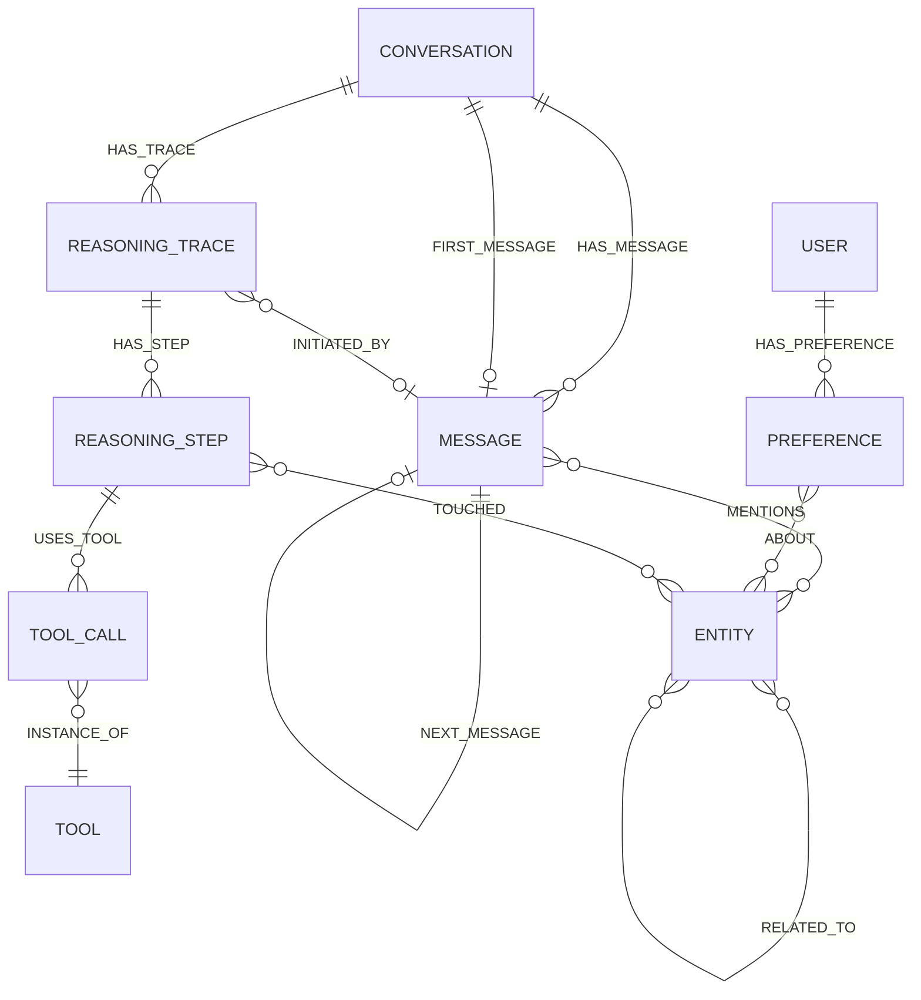
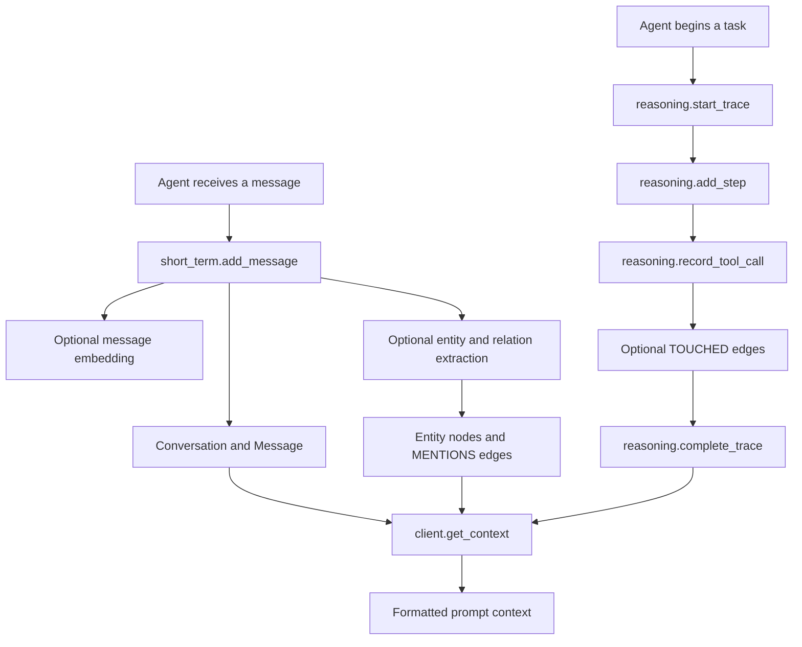

# Memory model and operations

The library divides agent memory into three connected domains. On the Bolt backend these are Neo4j nodes and relationships backed by package-managed constraints and indexes. Their public models are `Conversation`/`Message`, `Entity`/`Preference`/`Fact`/`Relationship`, and `ReasoningTrace`/`ReasoningStep`/`ToolCall`.

## Graph model

This is the primary Bolt graph structure used to connect conversations, durable knowledge, and execution history.

### Short-term memory

| Model | Key contents | Key graph behavior |
| --- | --- | --- |
| `Conversation` | `id`, `session_id`, optional title and metadata | Owns messages through `HAS_MESSAGE`; updated when messages are added |
| `Message` | role, content, timestamp, optional embedding and metadata | Ordered through `FIRST_MESSAGE` and `NEXT_MESSAGE`; can link to entities through `MENTIONS` |
| `ConversationSummary` | generated summary, time range, key entities and topics | Returned by a summary workflow rather than represented as a primary graph node |

`short_term.add_message()` can generate a message embedding and extract entities/relationships. `get_conversation()` returns messages ordered chronologically. `search_messages()` supports a session scope, result limit, similarity threshold, and metadata filters.

For high-volume Bolt ingestion, `add_messages_batch()` writes in transaction batches and maintains the message sequence. It defaults to disabled entity extraction for the batch for performance; extraction can be run separately afterwards.

### Long-term memory

| Model | Purpose | Important fields or behavior |
| --- | --- | --- |
| `Entity` | A resolved person, object, location, event, organization, or custom domain object | Name, canonical name, POLE+O type, optional subtype, aliases, attributes, description, confidence |
| `Relationship` | A typed entity-to-entity relation | Source and target IDs, type, confidence, temporal validity, and attributes |
| `Preference` | A preference categorized for personalization | Category, text, context, confidence, optional entity links |
| `Fact` | A declarative subject-predicate-object statement | Confidence and optional `valid_from`/`valid_until` time bounds |

The default entity schema is POLE+O: `PERSON`, `OBJECT`, `LOCATION`, `EVENT`, and `ORGANIZATION`. The Bolt implementation can represent the base type and subtype as labels, while preserving the normalized type in properties. `add_entity()` normalizes types, optionally resolves them, checks duplicates, can geocode locations, and can enqueue configured enrichment. It returns an entity plus a `DeduplicationResult`; an auto-merged duplicate returns the existing entity.

Entity deduplication is configurable. By default it uses embedding similarity and can also use fuzzy matching: candidates can be merged, flagged, or treated as distinct depending on thresholds. Facts and preferences can be searched semantically when their embeddings are present. For the Bolt-side text extraction pipeline, identity resolution order, and asynchronous external enrichment, see [Bolt extraction, entity resolution, and enrichment](extraction-resolution-and-enrichment.md).

### Reasoning memory

| Model | Purpose | Key graph behavior |
| --- | --- | --- |
| `ReasoningTrace` | A task-level execution record | Captures session, task, outcome, success, times, and task embedding |
| `ReasoningStep` | One thought/action/observation unit | Ordered by `HAS_STEP.order`; can carry a step embedding |
| `ToolCall` | A tool invocation during a step | Holds arguments, result, status, duration, and error; connects to a shared `Tool` |
| `Tool` | A tool name and aggregated usage record | Stores total, success, failure, duration, and latest-use counters |

A tool call can reference `touched_entities`. On Bolt this writes `(:ReasoningStep)-[:TOUCHED]->(:Entity)` edges for a compact audit path from an entity to the reasoning that affected it. The evaluator's audit-completeness dimension checks those edges.

## Typical memory workflow

This shows how new conversation data and execution history can feed later context retrieval.

## Assemble context for an agent

`MemoryClient.get_context(query, ...)` fetches selected memory regions and joins non-empty sections into a string suitable for an LLM prompt:

1. Short-term context, formatted under `## Conversation History`, is retrieved with the optional `session_id` and at most `max_items` messages.
2. Long-term context, formatted under `## Relevant Knowledge`, includes relevant facts and preferences up to `max_items`.
3. Reasoning context, formatted under `## Similar Past Tasks`, retrieves related traces with a maximum of `max_items // 2`.

Each category can be disabled with `include_short_term`, `include_long_term`, or `include_reasoning`. `MemoryIntegration.get_context()` wraps this result with the resolved session identifier and a `has_context` flag.

On NAMS, short-term context uses the hosted three-tier conversation context endpoint, while the NAMS long-term and reasoning `get_context()` implementations return an empty string. Use the hosted conversation context, entity search, and application-level composition as appropriate; see [Backends and querying](../architecture/backends-and-querying.md).

## Sessions, users, and tenancy

`MemoryIntegration` resolves a session identifier before every operation:

| `session_strategy` | Resolved session identifier |
| --- | --- |
| `per_conversation` | A UUID generated once per `MemoryIntegration` instance |
| `per_day` | `<user_id>-YYYY-MM-DD` in UTC, or `default-YYYY-MM-DD` without a user ID |
| `persistent` | The supplied user ID, or `default` |

An explicit `session_id` always wins over the strategy. On Bolt, setting `MemorySettings.memory.multi_tenant=True` makes memory APIs that accept `user_identifier=` reject an omitted identifier. Use it in production to make tenant scoping explicit. NAMS has different hosted scoping semantics: `userId` is sent where its endpoint supports it, and the API key scopes the workspace.

## Bolt-only operations for production upkeep

### Buffered writes

Set `MemorySettings.memory.write_mode="buffered"` to use `client.buffered.submit(query, params)` for explicit fire-and-forget Neo4j writes. The background drainer starts lazily. A full queue applies back pressure rather than dropping data. Call `await client.flush()` or `await client.wait_for_pending()` at shutdown; `MemoryClient.close()` also drains it before closing Bolt. Failures are retained in `client.write_errors` and do not stop later queued jobs.

The default `write_mode="sync"` does not queue: `submit()` awaits the underlying write and propagates its errors. Standard memory methods that return models remain synchronous persistence operations; buffering is an explicit low-level API.

### Consolidation and audit records

`client.consolidation` supplies Bolt maintenance primitives. They default to `dry_run=True` and return a `ConsolidationReport` with candidate details:

| Method | Non-dry-run effect |
| --- | --- |
| `dedupe_entities()` | Adds `SAME_AS` edges for high-similarity entity pairs |
| `summarize_long_traces()` | Marks long, unsummarized traces as `summarization_pending`; callers choose and run the actual summarizer |
| `detect_superseded_preferences()` | Adds `SUPERSEDED_BY` and closes the older preference validity window |
| `archive_expired_conversations(ttl_days=...)` | Marks older conversations as archived without deleting them |
| `record_read_audit(...)` | Writes an explicit `MemoryReadAudit`, optionally linked from a user |

Mutating consolidation runs also create a `ConsolidationRun` audit node. Read auditing is explicit: the library does not automatically record every graph read.

### Evaluation harness

`client.eval.run(EvalSuite(...))` evaluates supplied labeled cases independently across retrieval, audit, and preference dimensions. Retrieval is average recall at `k` over expected entity IDs. Audit coverage measures expected `TOUCHED` reasoning-step IDs. Preference fidelity uses F1 against expected active preference IDs. `EvalReport.overall_score` averages only dimensions that ran.

## Source locations

| Area | Source |
| --- | --- |
| Client context assembly and Bolt accessors | `src/neo4j_agent_memory/__init__.py` |
| Conversation models and operations | `src/neo4j_agent_memory/memory/short_term.py` |
| Entities, facts, preferences, and deduplication | `src/neo4j_agent_memory/memory/long_term.py` |
| Traces, steps, tool calls, and touched-entity hooks | `src/neo4j_agent_memory/memory/reasoning.py` |
| Bolt Cypher templates | `src/neo4j_agent_memory/graph/queries.py` |
| Buffered writer | `src/neo4j_agent_memory/memory/buffered.py` |
| Consolidation and read audit | `src/neo4j_agent_memory/memory/consolidation.py` |
| Evaluation types and scoring | `src/neo4j_agent_memory/memory/eval.py` |
