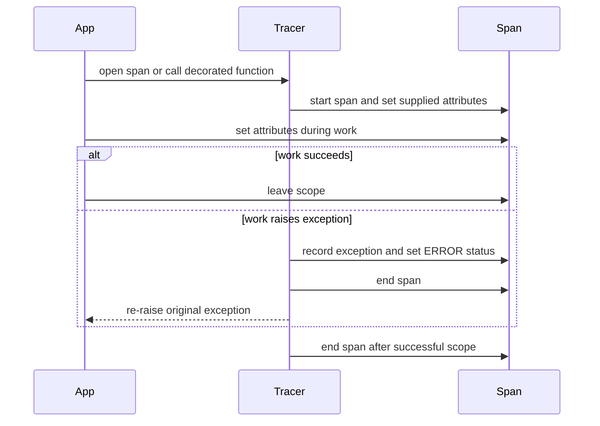

# Tracing and request observability

The repository has two observability surfaces with different purposes:

- The **Python SDK** exposes a generic tracing abstraction with no-op, OpenTelemetry, and Opik implementations. Applications can use it to trace their own work, including extraction or agent orchestration.
- The **TypeScript SDK** exposes a per-request `logger` callback from its HTTP transports. It reports NAMS request start, success/error status, duration, and a service request ID when available.

Neither surface is a guarantee that every memory operation is automatically traced. Add instrumentation deliberately at the application boundary and ensure that sensitive prompts, API keys, and tool inputs are not emitted to logs or span attributes without an explicit data-handling decision.

## Python tracer abstraction

Import from `neo4j_agent_memory.observability`:

```python
from neo4j_agent_memory.observability import get_tracer

tracer = get_tracer(provider="noop", service_name="support-agent")

@tracer.trace("prepare_agent_context", {"component": "memory"})
async def prepare_context() -> str:
    return "context"
```

`get_tracer()` accepts a `TracingProvider` value or its lowercase string equivalent:

| Provider | Behavior |
| --- | --- |
| `"noop"` | Returns a `NoOpTracer`; all span operations are safe no-ops |
| `"opentelemetry"` | Instantiates `OpenTelemetryTracer`; requires OpenTelemetry packages |
| `"opik"` | Instantiates `OpikTracer`; requires the `opik` package |
| `"auto"` | Selects Opik when importable, otherwise OpenTelemetry when importable, otherwise the no-op tracer |

Each call to `get_tracer()` replaces the module-level current tracer. `get_current_tracer()` returns the configured global tracer or a new no-op tracer when none has been configured.

### Span lifecycle and exception behavior

`Tracer` provides three equivalent ways to open a span:

```python
# Synchronous code
with tracer.span("prepare") as span:
    span.set_attribute("memory.backend", "bolt")

# Asynchronous code
async with tracer.async_span("prepare") as span:
    span.set_attribute("memory.backend", "nams")

# Decorate either a synchronous or asynchronous callable
@tracer.trace("prepare")
def prepare() -> None:
    pass
```



This is the base `Tracer` contract: errors are recorded and then propagated rather than swallowed by the tracing helper.

The decorator adds `function.name`, `function.module`, and `function.duration_ms`. The context managers do not add those function attributes automatically; set context-specific attributes yourself. A no-op tracer preserves the same control-flow and exception behavior without exporting telemetry, which makes it appropriate as a default in applications and tests.

## Python providers

### OpenTelemetry

Install the optional dependency group:

```bash
pip install "neo4j-agent-memory[opentelemetry]"
```

`OpenTelemetryTracer(service_name=..., endpoint=..., headers=...)` creates an OpenTelemetry `TracerProvider` with a `service.name` resource. When `endpoint` is provided it first tries the OTLP gRPC exporter, then the OTLP HTTP exporter. If neither exporter package is importable, it leaves the provider without an exporter rather than throwing during setup.

OpenTelemetry attributes accept scalar values directly. Lists and tuples have unsupported values converted to strings; other unsupported values are stringified. Supply only values acceptable for your collector and privacy policy.

### Opik

Install the optional dependency group:

```bash
pip install "neo4j-agent-memory[opik]"
```

`OpikTracer` accepts `service_name`, `project_name`, `api_key`, and `workspace`. If explicit Opik credentials are needed, source them through authorized environment or secret configuration rather than code. The adapter exposes the generic span interface and `track()` for Opik's native decorator. It also exposes `log_feedback(trace_id, name, value, reason=None)` for supported Opik client versions.

The Opik adapter makes its own span integration best-effort: failures in the dynamic Opik calls do not intentionally fail the traced application work. That is different from the base context manager's exception behavior, which still re-raises exceptions from the application body.

## TypeScript request logger

`MemoryClient` accepts `logger` in `MemoryClientOptions`. Both built-in transports invoke it for request, response, and error events. Logger errors are caught and ignored by the transports so an observability callback cannot make a memory request fail.

```ts
import { MemoryClient, type LogEvent } from "@neo4j-labs/agent-memory";

const memory = new MemoryClient({
  logger: (event: LogEvent) => {
    if (event.kind === "error") {
      console.error({
        method: event.method,
        status: event.status,
        requestId: event.requestId,
        durationMs: event.durationMs,
        message: event.message,
      });
    }
  },
});
```

| Event kind | Always present | May be present |
| --- | --- | --- |
| `request` | SDK method name, URL | HTTP method |
| `response` | SDK method name, URL, HTTP status, duration | `requestId` |
| `error` | SDK method name, URL, duration, message | HTTP status and `requestId` |

The REST and bridge transports derive `requestId` from `x-request-id`, `request-id`, or `x-amzn-requestid` response headers. SDK errors also retain the value on `MemoryError.requestId`. Include that identifier in a support issue, but do not add bearer tokens or unredacted sensitive data to the report.

The transports use a 30-second timeout by default and use `AbortSignal.timeout`. Network and timeout failures are surfaced as `ConnectionError`; authentication responses become `AuthenticationError`; other HTTP failures become `TransportError` with its status and parsed response body when available. See [TypeScript SDK for the hosted memory service](../typescript-sdk.md) for the full error model.

## Operational guidance

- **Assign meaningful names.** Use span and logger labels that identify a workflow stage, such as context assembly or entity extraction, rather than embedding raw user text.
- **Set safe attributes.** Backend choice, operation names, durations, and anonymous correlation IDs are generally safer than prompts, memory contents, or credentials.
- **Correlate at the service edge.** Record NAMS `requestId` from logger events or `MemoryError` for failed hosted calls.
- **Preserve application behavior.** Keep logging and exporter integration non-blocking where possible. The TypeScript logger is explicitly isolated; the Python tracer's context-manager contract intentionally preserves exceptions.
- **Validate optional providers.** Unit tests may skip provider-specific cases when an optional dependency is absent. Test a real exporter setup in its target deployment environment.

## Source map

| Concern | Location |
| --- | --- |
| Python tracing interfaces and provider selection | `src/neo4j_agent_memory/observability/base.py` |
| Python OpenTelemetry adapter | `src/neo4j_agent_memory/observability/otel.py` |
| Python Opik adapter | `src/neo4j_agent_memory/observability/opik.py` |
| Python observability exports and tests | `src/neo4j_agent_memory/observability/__init__.py`, `tests/unit/test_observability.py` |
| TypeScript log event types and request-ID extraction | `typescript/src/observability.ts` |
| TypeScript REST and bridge logging behavior | `typescript/src/transport/rest.ts`, `typescript/src/transport/bridge.ts` |
