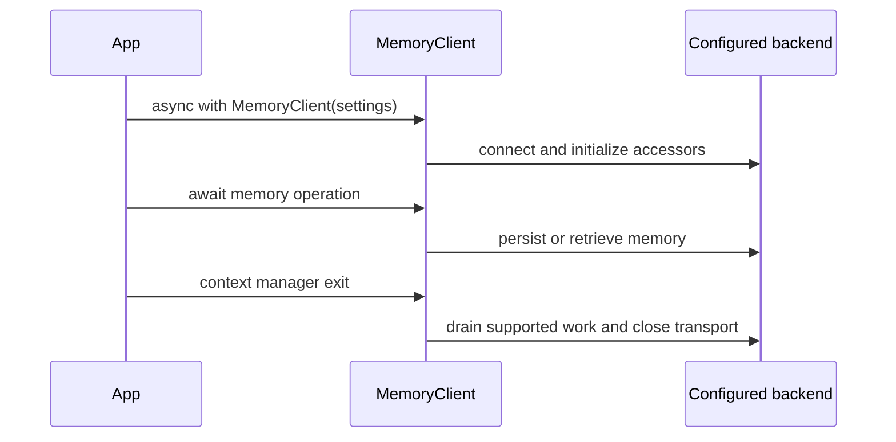

# Neo4j Agent Memory quickstart

`neo4j-agent-memory` is an asynchronous Python library for agent memory. A `MemoryClient` exposes three stores through one API:

- `short_term` for conversation messages;
- `long_term` for entities, preferences, facts, and entity relationships;
- `reasoning` for task traces, steps, and tool calls.

Choose the backend before writing application logic:

| Use case | Backend | Install | What you operate |
| --- | --- | --- | --- |
| Managed conversations, entities, and hosted extraction | NAMS | `pip install "neo4j-agent-memory[nams]"` | An account and `MEMORY_API_KEY` |
| Full graph control, preferences/facts/relationship writes, schema access, or local operation | Bolt | `pip install neo4j-agent-memory` plus the provider extras you use | Neo4j plus any chosen model providers |

The Python package requires Python 3.10 or later. The Bolt path depends on `neo4j>=5.20.0`; vector indexes are created when the connected Neo4j supports them.

## 1. Use the client as an async resource

Every memory operation is a coroutine. In a script, put calls inside `asyncio.run`; inside an existing async framework or notebook, await them directly. The context manager connects the chosen backend before use and closes it afterwards.

```python
import asyncio
from neo4j_agent_memory import MemoryClient


async def main() -> None:
    async with MemoryClient() as memory:
        await memory.short_term.add_message(
            session_id="support-42",
            role="user",
            content="Please help me compare two options.",
        )


asyncio.run(main())
```

The configuration determines which backend `MemoryClient()` uses. Do not create a client once and use its accessors after the context manager has closed.



This shows the normal client lifecycle for either configured backend.

## 2. Hosted NAMS setup

NAMS is selected automatically when `MEMORY_API_KEY` is available during `MemorySettings` construction. Install the NAMS extra, keep the real key in the environment or a secret manager, and pass a conversation identifier as `session_id`.

```bash
pip install "neo4j-agent-memory[nams]"
export MEMORY_API_KEY="your-NAMS-key"
```

```python
import asyncio
from neo4j_agent_memory import MemoryClient


async def main() -> None:
    async with MemoryClient() as memory:
        conversation_id = "conversation-uuid-from-your-application"

        await memory.short_term.add_message(
            session_id=conversation_id,
            role="user",
            content="I am planning a trip to Lisbon.",
        )
        await memory.long_term.add_entity("Lisbon", "LOCATION")

        context = await memory.get_context(
            "What travel context is available?",
            session_id=conversation_id,
        )
        print(context)


asyncio.run(main())
```

On NAMS, `session_id` is the hosted conversation identifier. Message extraction runs asynchronously; use `await memory.long_term.wait_for_extraction(session_id=conversation_id, expected_names=[...])` when application logic or a test must wait for a newly extracted entity to become searchable. See [backends and querying](architecture/backends-and-querying.md) for NAMS capability limits and consistency behavior.

## 3. Self-hosted Bolt setup

Pass `MemorySettings` for direct Neo4j access. Provider strings are resolved by `from_provider`; install the matching provider extra. The example uses environment variables rather than putting credentials in source control.

```bash
pip install "neo4j-agent-memory[openai]"
export NEO4J_PASSWORD="your-Neo4j-password"
export OPENAI_API_KEY="your-provider-key"
```

```python
import asyncio
import os

from pydantic import SecretStr
from neo4j_agent_memory import MemoryClient, MemorySettings, Neo4jConfig


async def main() -> None:
    settings = MemorySettings(
        backend="bolt",
        neo4j=Neo4jConfig(
            uri="bolt://localhost:7687",
            username="neo4j",
            password=SecretStr(os.environ["NEO4J_PASSWORD"]),
        ),
        embedding="openai/text-embedding-3-small",
        llm="openai/gpt-4o-mini",
    )

    async with MemoryClient(settings) as memory:
        await memory.short_term.add_message(
            session_id="support-42",
            role="user",
            content="I prefer concise answers.",
        )
        await memory.long_term.add_preference(
            category="communication_style",
            preference="Prefers concise answers",
        )
        context = await memory.get_context(
            "How should I respond?",
            session_id="support-42",
        )
        print(context)


asyncio.run(main())
```

On connection, the Bolt client creates the package-managed constraints and indexes, initializes the configured embedding, extraction, resolution, geocoding, and enrichment layers, and validates managed vector-index dimensions against the configured embedder. A dimension mismatch raises an actionable error rather than silently running searches with incompatible vectors.

## 4. Common next steps

| Goal | Start with |
| --- | --- |
| Persist and retrieve conversations | `client.short_term.add_message`, `get_conversation`, `search_messages` |
| Build a knowledge graph | `client.long_term.add_entity`, `add_relationship`, `add_fact` |
| Personalize per user | `add_preference(..., user_identifier=...)` with `memory.multi_tenant=True` in production |
| Record how an agent solved a task | `start_trace`, `add_step`, `record_tool_call`, `complete_trace` |
| Use memory from an MCP host | `neo4j-agent-memory mcp serve`; see [MCP server](integrations/mcp-server.md) |
| Run a safe custom inspection query | `client.query.cypher`; it accepts read-only Cypher only |
| Understand the storage model | [Memory model and operations](memory/model-and-operations.md) |

## Provider and optional-feature installs

The core install contains the Neo4j driver and configuration support. Install extras only for integrations in use:

| Capability | Extra |
| --- | --- |
| Native OpenAI, Anthropic, or AWS Bedrock adapters | `[openai]`, `[anthropic]`, `[bedrock]` |
| Local Hugging Face embeddings | `[sentence-transformers]` |
| Universal provider adapter | `[litellm]` |
| Hosted NAMS transport | `[nams]` |
| FastMCP server | `[mcp]` |
| Local extraction pipeline | `[spacy]`, `[gliner]`, or `[extraction]` |
| Framework adapters | `[langchain]`, `[pydantic-ai]`, `[google-adk]`, `[strands]`, `[crewai]`, `[llamaindex]`, `[openai-agents]`, or `[microsoft-agent]` |

For a provider string such as `"openai/gpt-4o-mini"`, native adapters are preferred when installed; LiteLLM is the fallback. See [architecture overview](architecture/overview.md) for component boundaries.
