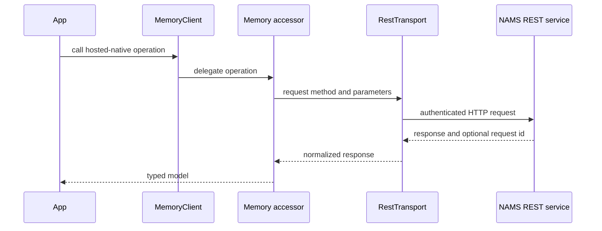
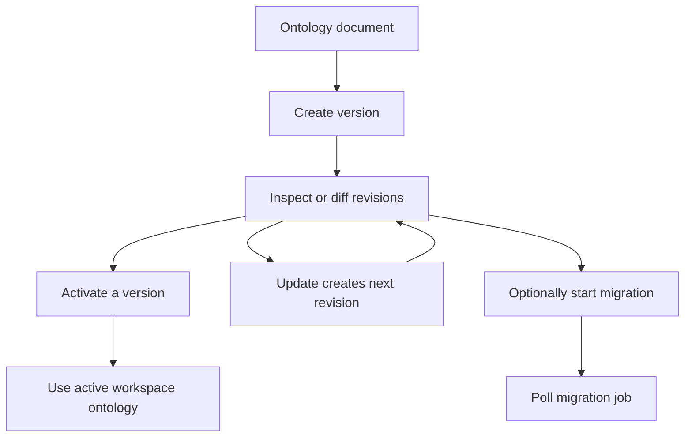

# TypeScript SDK for the hosted memory service

`@neo4j-labs/agent-memory` is the repository's TypeScript client for the hosted Neo4j Agent Memory Service (NAMS). It is a separate npm package from the Python SDK, built from `typescript/src/` and released independently. It requires Node.js 20 or later and uses `fetch`, so the supported runtime set includes Node, Bun, Deno, Cloudflare Workers, and Vercel Edge.

> **Scope boundary:** the TypeScript SDK targets NAMS. It does not create a direct Bolt connection or expose the Python SDK's self-hosted-only helpers such as schema management and buffered writes. Use the Python SDK when direct Neo4j Bolt operation is required.

## Install and construct the client

```bash
npm install @neo4j-labs/agent-memory
```

The default constructor sends requests to `https://memory.neo4jlabs.com/v1` and, where `process.env` exists, reads `MEMORY_API_KEY`. Keep real keys out of source and provide them through the deployment environment or secret manager.

```ts
import { MemoryClient } from "@neo4j-labs/agent-memory";

const memory = new MemoryClient();

const conversation = await memory.shortTerm.createConversation({
  userId: "user-42",
});
await memory.shortTerm.addMessage(conversation.id, "user", "I prefer concise answers.");

const context = await memory.shortTerm.getContext(conversation.id);
console.log(context.reflections, context.observations, context.recentMessages);

await memory.close();
```

For an edge request handler, provide the key explicitly because it is normally exposed by the request environment rather than `process.env` at module scope:

```ts
const memory = new MemoryClient({ apiKey: env.MEMORY_API_KEY });
```

`connect()` is optional. By design, the first real request serves as the implicit connectivity and authentication check. Call `await memory.connect()` at startup when an application instead needs a fail-fast probe. `close()` delegates to the underlying transport; the built-in HTTP transports currently have no persistent connection to tear down, but calling it makes lifecycle ownership explicit and keeps code compatible with injected transports.

## Client surface and memory domains

`MemoryClient` constructs six accessors around one transport:

| Accessor | Role | Examples of hosted-native operations |
| --- | --- | --- |
| `shortTerm` | Conversations, messages, and three-tier context | `createConversation`, `getContext`, `bulkAddMessages`, `getObservations`, `getReflections` |
| `longTerm` | Entities, graph views, feedback, history, and extraction wait | `listEntities`, `getEntity`, `updateEntity`, `mergeEntities`, `expandGraph` |
| `reasoning` | Conversation-scoped agent steps, tool calls, and provenance | `recordStep`, `getTraceByConversation`, `explainStep`, `getEntityProvenance` |
| `query` | Read-only graph inspection | `cypher({ cypher, params })` |
| `auth` | Hosted API keys and refresh-token exchange | `listApiKeys`, `createApiKey`, `rotateApiKey`, `revokeApiKey` |
| `ontology` | Versioned domain schemas extending POLE+O | `list`, `create`, `update`, `activate`, `diff`, `migrate` |

The primary response models use camelCase. The package translates its bridge-compatible internal method names and the REST wire format so application code uses the accessor APIs rather than calling routes itself.

### Conversation-scoped hosted data

NAMS uses a conversation identifier. `shortTerm.addMessage` and `getConversation` accept `sessionId` as the canonical client parameter and `conversationId` as an alias in their options; if both appear, `sessionId` wins. Hosted-native APIs, such as `createConversation` and `getContext`, use `conversationId` directly.

The rich hosted context is a `ConversationContext` with these layers:

- `reflections`: higher-level material derived from observations;
- `observations`: summaries over message windows; and
- `recentMessages`: the current recent conversation window.

Use that three-tier result when preparing an agent prompt. `bulkAddMessages` accepts at most 100 messages per request. Entity extraction can be asynchronous; `longTerm.waitForExtraction()` polls entity search with a query, expected names, or a predicate until the requested condition is true or its timeout expires. For a specific new entity, `expectedNames` or a predicate is safer than a raw minimum-result count because a populated workspace may already satisfy that count.

### Hosted capabilities and bridge-only methods

Some classes retain bridge/TCK-shaped methods alongside the hosted-native API. The default transport selects REST for an endpoint whose path includes `/vN`, including the default NAMS endpoint. On REST, operations that have no NAMS REST equivalent, such as `addPreference`, `addFact`, `addRelationship`, `startTrace`, and `completeTrace`, throw `NotSupportedError`.

Use the hosted-native alternatives rather than assuming all bridge methods work against NAMS:

| Goal | Use with NAMS REST |
| --- | --- |
| Create and manage conversations | `shortTerm.createConversation`, `listConversations`, `deleteConversation` |
| Add and retrieve messages | `addMessage`, `bulkAddMessages`, `getConversation` |
| Build three-tier prompt context | `getContext`, `getObservations`, `getReflections` |
| Record agent reasoning | `reasoning.recordStep` and `reasoning.recordToolCall` |
| Inspect agent history | `getTraceByConversation`, `explainStep`, `getEntityProvenance` |
| Manage entities | `addEntity`, `getEntity`, `updateEntity`, `setEntityFeedback`, `mergeEntities` |
| Inspect the graph | `query.cypher` with read-only Cypher |

The `BridgeTransport` speaks a TCK conformance protocol, posts snake_case method names, and is intended for conformance testing or local adapters. It is not the application path for NAMS. It is exposed from `@neo4j-labs/agent-memory/testing`; `RestTransport` is the public production transport.



This shows the default NAMS REST request path; the accessors own wire-shape conversion before returning SDK models.

## Configuration, authentication, and tenant scope

The constructor accepts this application-facing configuration:

| Option | Purpose |
| --- | --- |
| `endpoint` | NAMS REST base URL; defaults to `https://memory.neo4jlabs.com/v1` |
| `apiKey` | Static bearer token; falls back to `MEMORY_API_KEY` unless explicitly set, including an intentional empty string |
| `tokenProvider` | Synchronous or asynchronous token callback; takes precedence over `apiKey` |
| `workspaceId` | Adds `X-Workspace-Id`; falls back to `MEMORY_WORKSPACE_ID` |
| `transport` | `"auto"`, `"rest"`, or `"bridge"`; auto chooses REST for `/vN` endpoint paths |
| `timeout` | Per-request limit in milliseconds; default `30000` |
| `headers` | Additional headers for every request |
| `logger` | Receives request, response, and error events |
| `namespace` | Declared in `MemoryClientOptions`, but not forwarded during built-in transport construction; do not rely on it for runtime scoping |

An explicit `X-Workspace-Id` within `headers` wins over `workspaceId`. Workspace is the NAMS tenancy boundary and is distinct from `userId`, which identifies the user recorded on a conversation. The client applies bearer authentication using `tokenProvider` when supplied, otherwise the static API key.

The `auth` accessor can create, list, rotate, reveal, and revoke service keys, and can exchange a refresh token. API key responses may contain plaintext `key` values only when the service returns them. Treat any such value as sensitive: persist it only in authorized secret storage and never log it or commit it to an example.

## Errors and request correlation

All SDK-specific errors derive from `MemoryError`. Failed HTTP calls carry a `requestId` when NAMS emits a supported request-ID response header. Include that ID in a support report; it helps correlate the client failure with service logs.

| Error | Meaning |
| --- | --- |
| `ConnectionError` | A network failure, timeout, or service error while connecting/requesting |
| `AuthenticationError` | NAMS responded with 401 or 403 |
| `TransportError` | A non-success transport response; includes `statusCode` and `responseBody` when available |
| `NotSupportedError` | The selected transport cannot implement the requested SDK method |
| `NotFoundError` | An SDK operation did not find its requested resource |
| `ValidationError` | The SDK rejected invalid client input or transport configuration |

The optional `logger` receives typed events for request start, response, and error. Response and error events can carry the HTTP status, request ID, and duration; logger failures are intentionally suppressed so observability code does not break a memory operation.

## Ontology lifecycle

`client.ontology` manages NAMS-hosted domain schemas. An `OntologyDocument` has a `domain`, typed `entityTypes` that map to a POLE+O base type, and typed relationships. The service stores versions with a revision and validation mode. Conceptually, the lifecycle is:



This reflects the versioned ontology API: activation targets a version, and a migration is an asynchronous job rather than a synchronous label rewrite.

`ontology.import()` accepts either inline `content` or an HTTPS `url`, not both, and returns a non-persisted draft plus conversion warnings. Persist a successful draft with `ontology.create()`. The ontology sub-API intentionally sends snake_case bodies even though the rest of the TypeScript client presents camelCase models.

## Framework and MCP adapters

The package exports optional integration surfaces without requiring their frameworks at its own compile time:

| Consumer | Import | Integration behavior |
| --- | --- | --- |
| Vercel AI SDK v4+ | `@neo4j-labs/agent-memory/middleware/vercel-ai` | Injects three-tier context when available, can persist user input before generation and assistant text afterward, and falls back to flat history |
| LangChain JS | `@neo4j-labs/agent-memory/integrations/langchain` | Provides `Neo4jChatMessageHistory` and `Neo4jEntityRetriever` shapes |
| Mastra | `@neo4j-labs/agent-memory/integrations/mastra` | Maps Mastra threads and messages to hosted conversations and messages |
| AWS Strands | `@neo4j-labs/agent-memory/integrations/strands` | Provides session storage, context injection, and best-effort reasoning hooks |
| MCP tool host | `@neo4j-labs/agent-memory/mcp` | Exposes tool definitions plus `handleMemoryToolCall` for an MCP server you own |

The TypeScript MCP module defines **12** hosted-standard tools. It is distinct from the Python FastMCP server, whose `extended` profile exposes 16 tools for the Python SDK's two-backend model. Do not use tool counts or exact tool names from one SDK as documentation for the other.

The repository also ships the independently released `@neo4j-labs/nams-ai-provider` package. It is a Vercel AI SDK v7 `ProviderV4`/middleware/tools integration with cross-session retrieval and optional MCP tool merging, rather than a subpath of this SDK. See [NAMS provider for Vercel AI SDK](typescript/nams-ai-provider.md) for its scope, lifecycle, and helper behavior.

The in-tree `typescript/examples/mcp/` application shows how to register the 12 TypeScript tool definitions on `@modelcontextprotocol/sdk` over stdio. The hosted service also exposes an MCP endpoint at `https://memory.neo4jlabs.com/mcp`; self-hosting is useful when a caller needs to log, audit, filter, or rewrite tool calls on the path to NAMS.

## Develop and validate the package

```bash
cd typescript
npm ci
npm run lint
npm run test:unit
npm run test:integration
npm run build
npm pack --dry-run
```

`npm run lint` runs `tsc --noEmit`. `npm test` runs both unit and integration suites. The CI workflow tests Node 20 and 22, builds the artifact, checks its package contents, and type-checks every in-tree framework example after building `dist/`. See [Development environment and verification workflow](development/contributor-workflow.md) for the root `make ts-*` equivalents and hosted end-to-end test rules.

## Source map

| Concern | Location |
| --- | --- |
| Package metadata, exports, scripts | `typescript/package.json` |
| Client construction and transport selection | `typescript/src/client.ts` |
| Memory data types and options | `typescript/src/types.ts` |
| REST route mapping and error conversion | `typescript/src/transport/rest.ts` |
| TCK bridge transport | `typescript/src/transport/bridge.ts` |
| Short-term, long-term, reasoning, and query accessors | `typescript/src/short-term/`, `typescript/src/long-term/`, `typescript/src/reasoning/`, `typescript/src/query/` |
| API-key authentication | `typescript/src/auth/` |
| Hosted ontologies | `typescript/src/ontology/` |
| Framework and MCP integration modules | `typescript/src/integrations/`, `typescript/src/middleware/`, `typescript/src/mcp/` |
| Runnable integration examples | `typescript/examples/` |
| Tests | `typescript/test/` |
