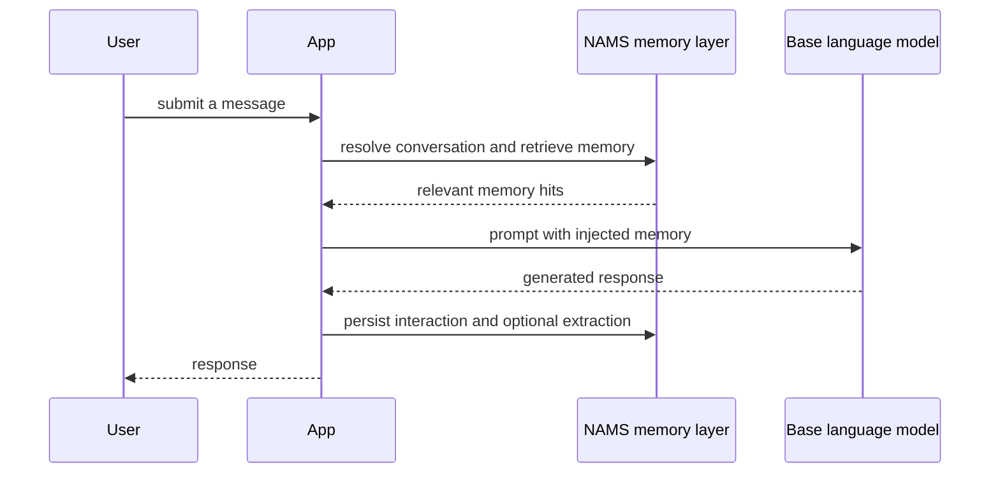

# NAMS provider for Vercel AI SDK

`@neo4j-labs/nams-ai-provider` is a separately published TypeScript package that adds NAMS memory to Vercel AI SDK v7 applications. It is not the same surface as the minimal Vercel middleware exported from `@neo4j-labs/agent-memory/middleware/vercel-ai`: this package targets `ProviderV4`, supports cross-session retrieval, optional graph extraction, explicit memory tools, and optional MCP tool merging.

It requires Node.js 20 or later. Its peer dependencies include `ai` v7, `@ai-sdk/provider` v4, `@neo4j-labs/agent-memory` approximately version `0.4`, and `zod`; `@ai-sdk/mcp` is optional and only needed for MCP tool merging.

```bash
npm install @neo4j-labs/nams-ai-provider ai @ai-sdk/provider @neo4j-labs/agent-memory zod
```

## Choose an integration mode

| Mode | Primary API | Retrieval and persistence | Best fit |
| --- | --- | --- | --- |
| Provider | `createNamsProvider(options)` | Automatic on model calls | A Vercel AI provider registry or a straightforward model swap |
| Middleware | `createNams(config).wrap(model, scope)` | Automatic on model calls | An existing `LanguageModelV4` instance that needs transparent memory |
| Tools | `createNams(config).tools(scope)` | Model-driven through `query_memory` and `store_memory` | A tool loop where memory use should be visible and controllable |

The provider and middleware modes retrieve relevant memories before generation and persist the turn after generation. Tools mode exposes that behavior as two model-callable tools, so prompt instructions and enforcement policy matter.



This is the transparent provider/middleware path; tools mode lets the model issue its own retrieval and storage calls instead.

## Configuration and scope

All modes accept NAMS connection settings plus a user scope:

| Setting | Required | Meaning |
| --- | --- | --- |
| `apiKey` | Yes | NAMS API key; read it from authorized environment or secret configuration |
| `endpoint` | No | NAMS REST base URL; defaults to `https://memory.neo4jlabs.com/v1` |
| `workspaceId` | No | NAMS workspace selector |
| `logger` | No | Non-fatal warning/error sink; defaults to console output |
| `scope.userId` | Yes | Identifies the application user for memory lookup and conversation resolution |
| `scope.conversationId` | No | Pins the NAMS conversation instead of selecting or creating one |
| `maxMemories` | No | Maximum memory hits injected or returned; default is 6 |
| `persistInteractions` | No | Persist turns in transparent modes; default is `true` |
| `extractionModel` | No | Enables client-side graph extraction for stored non-interaction memories |
| `extractionOptions` | No | Adjusts graph-extractor behavior, such as `skipEntity` |

Each provider, middleware, or tools factory call creates a `MemoryClient` with an instance-local conversation cache. Conversation resolution is ordered as: explicit `conversationId`, cached value for workspace/user, the user's most recent NAMS conversation, then creation of a new conversation. Create an instance per user session or otherwise maintain a scope discipline that prevents applying one user's cached conversation to another user's work.

## Provider and middleware modes

Provider mode returns a standard `ProviderV4`. It delegates language models to a base provider and wraps every returned model with NAMS memory.

```ts
import { createNamsProvider } from "@neo4j-labs/nams-ai-provider";
import { openai } from "@ai-sdk/openai";

const nams = createNamsProvider({
  apiKey: process.env.MEMORY_API_KEY!,
  baseProvider: openai,
  scope: { userId: session.userId },
});

const model = nams.languageModel("gpt-5.4-mini");
```

`createNamsProvider()` is appropriate for `createProviderRegistry`. It implements `languageModel()` only: `embeddingModel()` and `imageModel()` deliberately throw `NoSuchModelError`.

Middleware mode decorates an existing model instead:

```ts
import { createNams } from "@neo4j-labs/nams-ai-provider";
import { openai } from "@ai-sdk/openai";

const nams = createNams({ apiKey: process.env.MEMORY_API_KEY! });
const model = nams.wrap(openai("gpt-5.4-mini"), { userId: session.userId });
```

Before a call, the middleware retrieves memory from long-term entities, current-conversation messages, past conversations for the same user, and selected reasoning steps. When it finds hits, it prepends a formatted memory block to the last user message. It attempts to save the original user text once per multi-step tool loop and saves a non-empty assistant result after generation or stream completion. Retrieval and persistence failures are logged and do not turn a successful model call into an error.

## Tools mode and enforcement helpers

`createNams(config).tools(scope)` returns Vercel AI SDK tools named `query_memory` and `store_memory`.

| Tool | Input behavior | Effect |
| --- | --- | --- |
| `query_memory` | Query text and a `limit` from 1 to 20, default 5 | Retrieves ranked memory hits; failures become a `found: false` result and are logged |
| `store_memory` | Text up to 2,000 characters, type, confidence, and tags | Persists an `interaction`, `fact`, `pattern`, or `user_preference` memory |

Tool descriptions encourage retrieval before answering and storage of new user information, but language models may still skip a tool. The package offers two opt-in helpers for a tool-loop application:

- `enforceQueryMemory()` returns a `prepareStep` hook. Until `query_memory` has run, it requires a tool call; after its grace window (default 3 steps), it forces `query_memory`. Keep the grace window at least two steps below the agent's stop budget so the query and final answer fit.
- `ensureMemoryStored(tools)` returns an `onFinish` hook. If `store_memory` did not run, it stores a fallback memory—by default the final assistant text as an `interaction`. It needs the exact tools object returned by this package; a shallow copy loses its associated client handle and is rejected.

Use these helpers only for pure tools mode. A middleware-wrapped model already retrieves memory unconditionally, so forcing a second `query_memory` call would duplicate work.

## Graph extraction and hosted limitations

By default, `store_memory` writes interactions to short-term conversation memory. For other memory types, it can optionally call a supplied `extractionModel` to extract entities and relations before writing them. Without an extractor—or after extraction fails—it falls back to one long-term entity named from the stored content and attempts to attach confidence feedback.

NAMS REST currently has no relationship-write endpoint. With graph extraction, extracted entity writes can succeed while relationship writes are skipped; the package logs this unsupported condition once per client rather than flooding logs for every edge. An extraction failure is similarly logged at error level once and then as warnings. Treat successful turn persistence as distinct from successful graph extraction.

The extractor includes a self-referential guard so an agent response about what it already remembers does not recursively create low-quality memory-about-memory entities. Use `extractionOptions.skipEntity` to add application-specific filters.

## Merge MCP tools when needed

`await nams.toolsWithMcp(scope, mcpConfig)` returns `{ tools, close, mcp }`, merging the two NAMS memory tools with tools fetched from an HTTP MCP server.

```ts
const { tools, close, mcp } = await nams.toolsWithMcp(
  { userId: session.userId },
  { url: "https://mcp.example.com/mcp", toolPrefix: "mcp_" },
);

try {
  // Pass tools to the Vercel AI SDK agent.
} finally {
  await close();
}
```

Call `close()` when the agent finishes. `mcp.toolNames` reflects the tool names actually available. If MCP connection is required, a refused/unreachable connection raises `NamsMcpConnectionError`, which can include the HTTP status and authentication challenge. With `mcp.optional: true`, the package reports that error in `mcp` and continues with NAMS memory tools only.

Avoid name collisions: without a `toolPrefix`, an MCP tool with the same name as a NAMS tool overwrites the NAMS tool in the merged set after the package logs a warning.

## Develop and validate

```bash
cd typescript/packages/vercel-ai-provider
npm ci
npm run typecheck
npm test
npm run build
```

This component releases independently when a `nams-ai-provider-v*` tag triggers `.github/workflows/publish-nams-ai-provider.yml`.

## Source map

| Concern | Location |
| --- | --- |
| Package metadata and peer dependencies | `typescript/packages/vercel-ai-provider/package.json` |
| Public factory and exports | `typescript/packages/vercel-ai-provider/src/index.ts` |
| ProviderV4 adapter | `typescript/packages/vercel-ai-provider/src/vercel-ai-provider.ts` |
| Transparent middleware | `typescript/packages/vercel-ai-provider/src/vercel-ai-provider-middleware.ts` |
| NAMS client, conversation cache, retrieval, and storage | `typescript/packages/vercel-ai-provider/src/vercel-ai-provider-client.ts` |
| Tools and MCP merging | `typescript/packages/vercel-ai-provider/src/vercel-ai-provider-tools.ts` |
| Package tests and examples | `typescript/packages/vercel-ai-provider/test/`, `typescript/packages/vercel-ai-provider/examples/` |
| Main TypeScript SDK | [TypeScript SDK for the hosted memory service](../typescript-sdk.md) |
